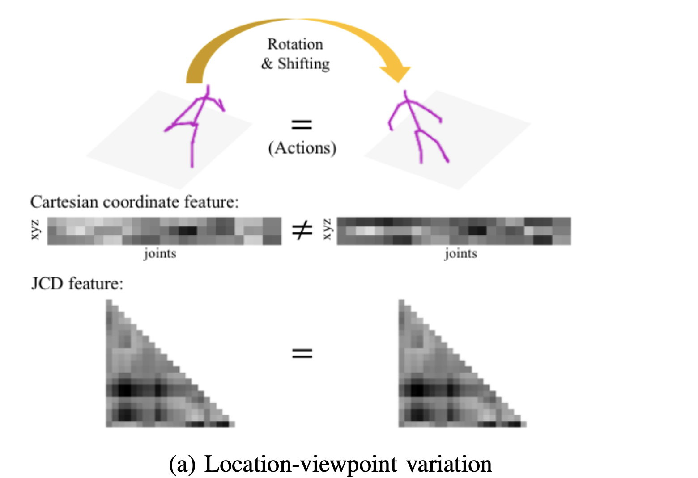
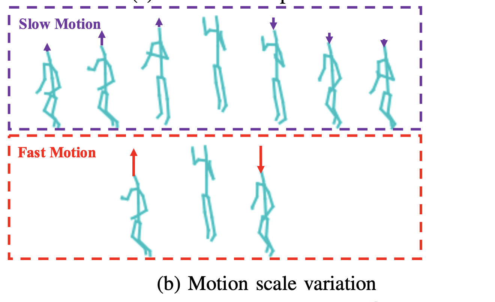
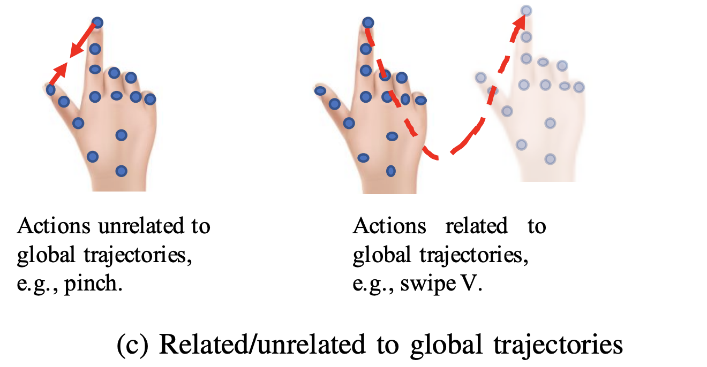
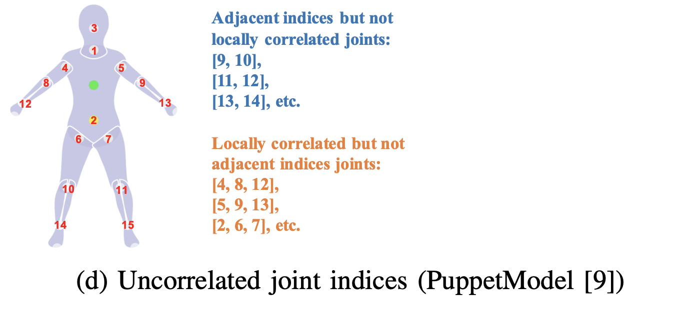
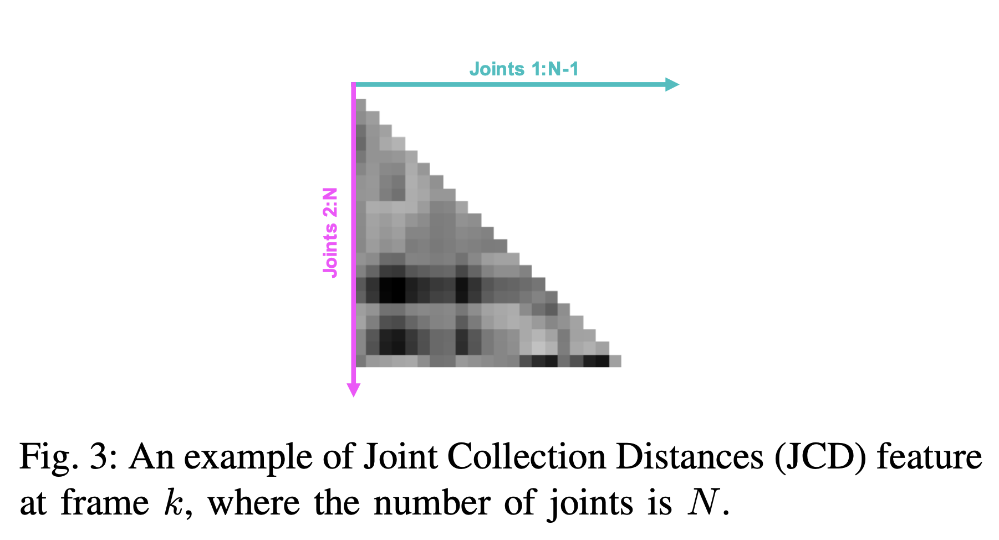
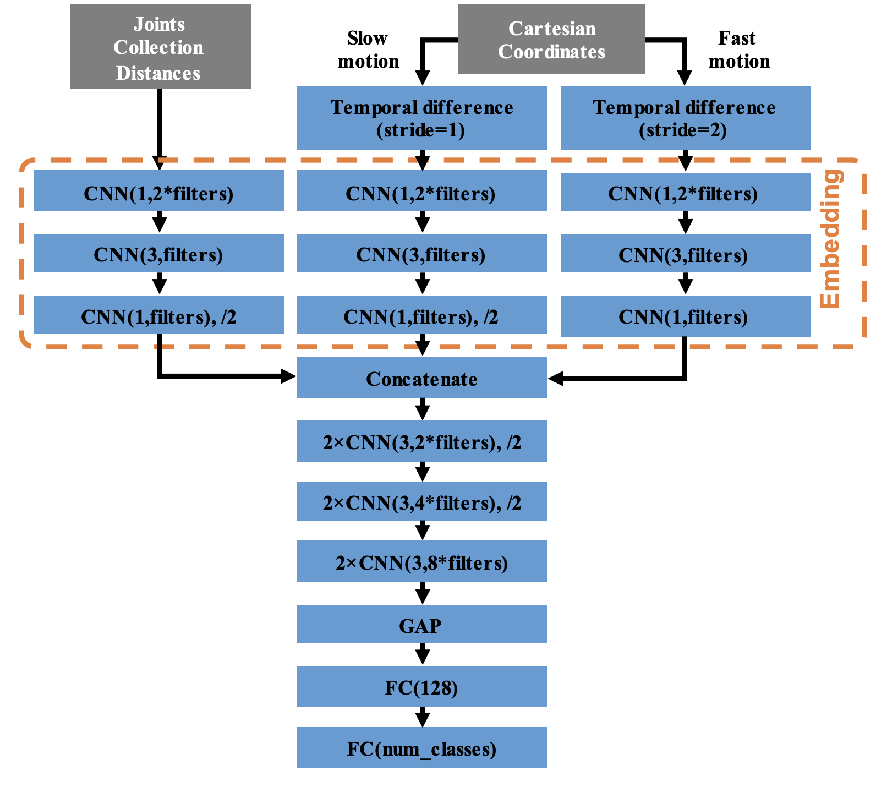
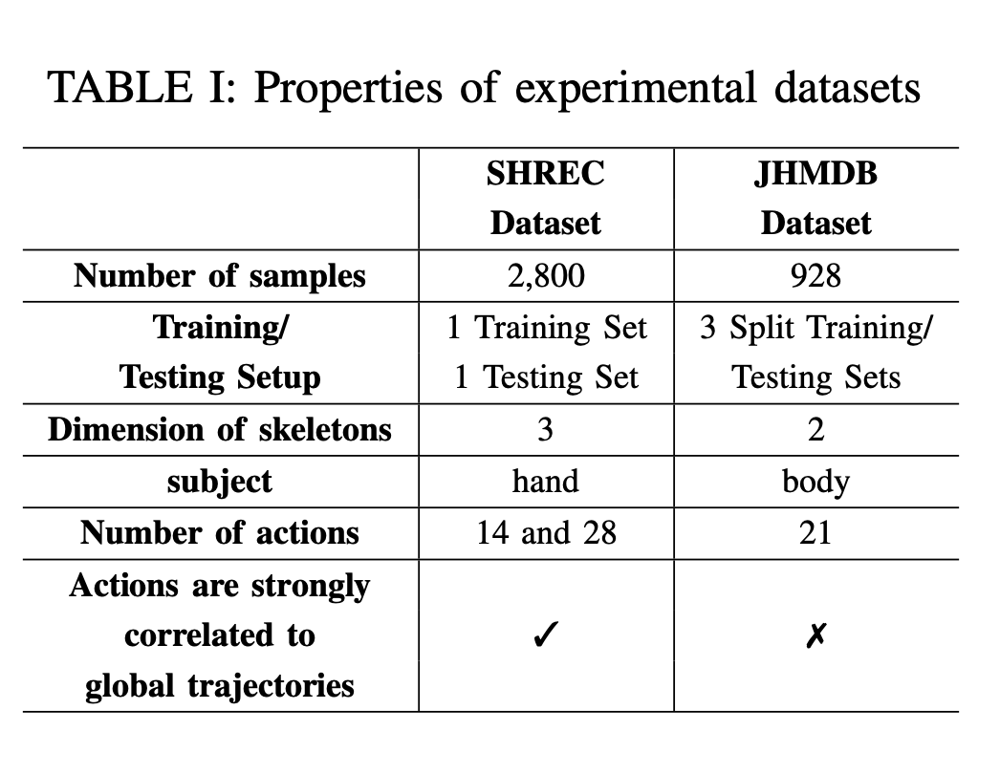
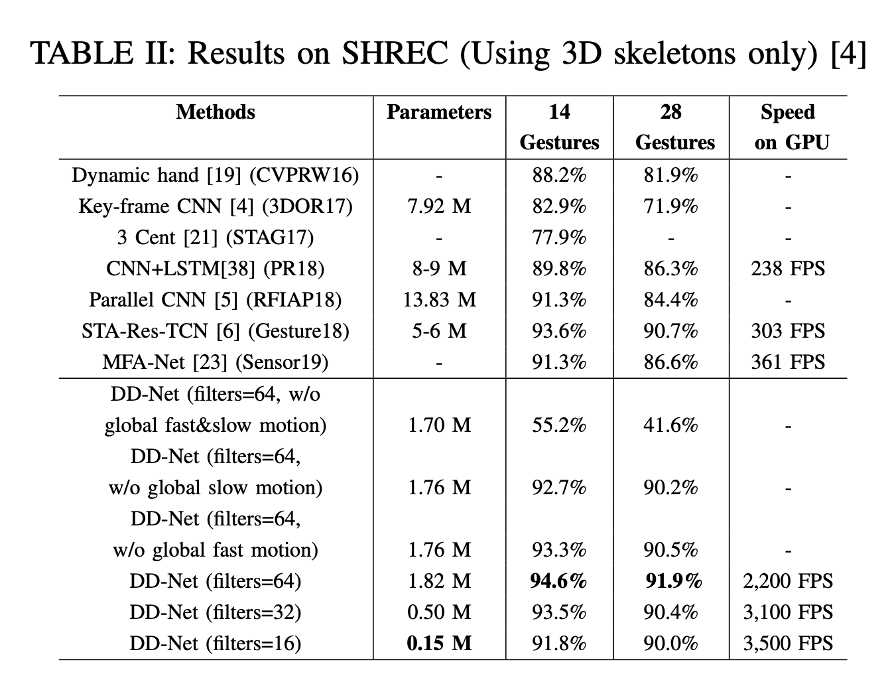
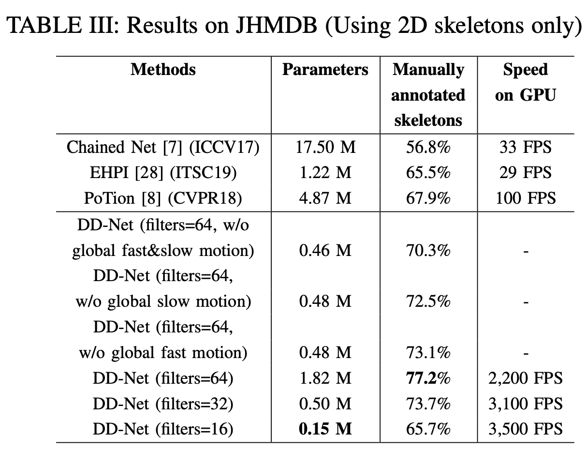

# Make Skeleton-based Action Recognition Model Smaller, Faster and Better

[paper](https://arxiv.org/pdf/1907.09658.pdf)

[github](https://github.com/fandulu/DD-Net)

# Introduction

* Skeleton-based action recognition have done a lot great job on accuracy, but they are slow to excute and large model size.
* we propose a feature engineering plus modeling method to make all pipeline faster -Double-feature Double-motion Network (DD-Net)
* Super fast speed, as 3, 500 FPS on one GPU, or, 2, 000 FPS on one CPU. By employing robust features, DD-Net achieves the state-of-the-art performance on our experiment datasets: SHREC(i.e., hand actions) and JHMDB (i.e., body actions)

# Idea

The prior knowledge of skeleton-based action recognition :

</img>

</img>

</img>

</img>

A. geometric feature are used like joint-combine features and Cartesian coordinate feature

   - Joint-combine features is  **location-viewpoint invariant**(which could capture change of pose)
   -  Cartesian coordinate feature is variant to locations and viewpoints(which could capture change of locations)

  + Joint-conbine features may need to be heavily redesigned from one dataset to another or contain redundant elements
* We propose JCD(joint collection distance) to make prediction robust.

</img>

B. Modeling Global Scale-invariant Motions by a Two-scale Motion Feature

    - JCD contains local information, now we need global moving information.
    - We propose Cartesian coordinate feature with 2 motion scale 

C. Modeling Joint Correlations by an Embedding

  + In different actions, the correlation of joints could be dynamically changed. Hence, the difficulty arises when we try to pre-define the correlation of joints by manually ordering their indices.
  + Since most of neural networks inherently assume that inputs are locally correlated, directly processing the locally uncorrelated joint feature is inappropriate
  +  DD-Net embeds the JCD feature and the two-scale motion feature into latent vectors at each frame. The correlation of joints is automatically learned through the embedding. As another benefit, the embedding process also reduces the effect of skeleton noise

</img>

# Experiment dataset

</img>

# Result

</img>

</img>

# Other Discussion

1. I tried to get the confusion martrix of ddnet on jhmdb. The result shown overfitting and imblance accuracy on some action class. 

2. They didn't put the result on NTU+D 3D. It means the result might be bad. 

3. Overall, DDNET framework give me some insight about skeleton-based action recognition and a good start point.
