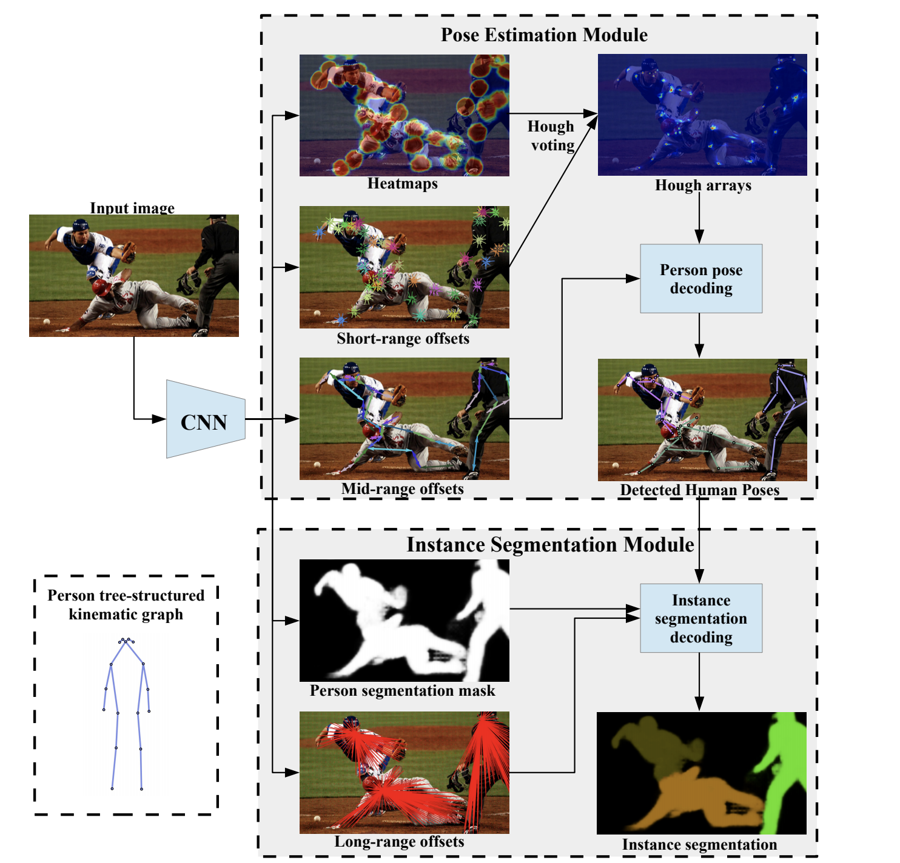
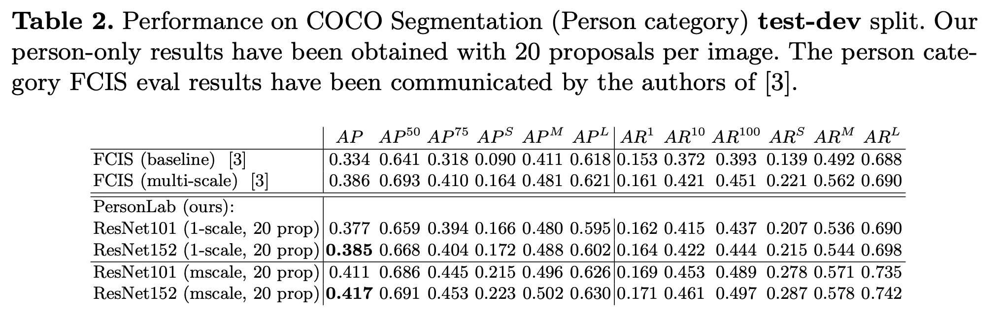

# PersonLab: Person Pose Estimation and Instance Segmentation with a Bottom-Up, Part-Based, Geometric Embedding Model

[paper](https://arxiv.org/pdf/1803.08225.pdf)

[github](https://github.com/octiapp/KerasPersonLab)

2018

George Papandreou, Tyler Zhu, Liang-Chieh Chen, Spyros Gidaris, 
Jonathan Tompson, Kevin Murphy

# Introduction

1. Bottom-up approach (which means no bouding-box first)

2. We use one-stage model

3. Takes both semantic-level reasoning and object-part associations using part-based modeling.

4. CNN to detect keypoints and thier relative displayment, then we use the relative displayment to group keypoints to a person pose instance.

5. We propose a part-induced geometric embedding descriptor which allows us to associate semantic person pixels with their corresponding person instance,

6. Fully-convolutional architecture and allows for efficient inference with runtime essentially independent of the number of people present in the scene. 

7. Our system achieves COCO test-dev keypoint average precision of 0.665 using single-scale inference and 0.687 using multi-scale inference, significantly outperforming all previous bottom-up pose estimation systems. We are also the first bottom-up method to report competitive results for the person class in the COCO instance segmentation task, achieving a person category average precision of 0.417.

# Keywords

Person detection, pose estimation, segmentation and grouping

# Idea

We design it in an instance-agnostic fashion.

two steps:

1. Detect $K$ keypoints(in coco dataset, $K=17$) 

2. Grouping them to person instance.

</img>

CNN model will predict (5 stuff): 

**Pose Estimation Module**

1. keypoint heatmaps(might be multiple people in the image)

2. short-range offsets(keypoint heatmap to the ground truth(point), like a tighten regression)

3. mid-range pairwise offsets(keypoint pairs offsets)

**Instance Segmentation Mudule**

4. person segmentation maps(pixel-wise)

5. long-range offsets(one person, one center)

keypoints heatmaps(one channel per keypoint) is a classification task output value in $[0, 1]$

offsets (two channels per keypoint for displacements in the horizontal and vertical directions) is a regression task( set radius $R = 32$pixels). **We have deliberately opted for a disk radius which does not scale with the instance size in order to equally weigh all person instances in the classification loss.**

# In detail

1. heatmap loss as the average logistic loss along image positions and we back-propagate across the full image only excluding areas that contain people that have not been fully annotated with keypoints (person crowd areas and small scale person segments in the COCO dataset).

2. the short-range 2-D offset vector $S_k(x) = y_{j,k} − x$ points from the image position $x$ to the $k_{th}$ keypoint of the closest person instance $j$. we penalize the short-range offset prediction errors with the **L1 loss**, averaging and back-propagating the errors only at the positions $x \in D_{R}(y_{j, k})$ in the keypoint disks. $R$ = 32 pixels in order to normalize them and make their dynamic range commensurate with the heatmap classification loss. where 

$$
D_{R}(y) = \{x : |x − y| \leq R\} 
$$

and $y_{j, k}$ be the 2-D position of the $k_{th}$ keypoint of the $j_{th}$ person instance, with
$j = 1, ... , M$ where M is the number of person instances in the image.

We aggregate the heatmap and short-range offsets via Hough voting into 2-D
Hough score maps $h_k (x), k = 1, ... , K$

# Results

</img>

</img>
