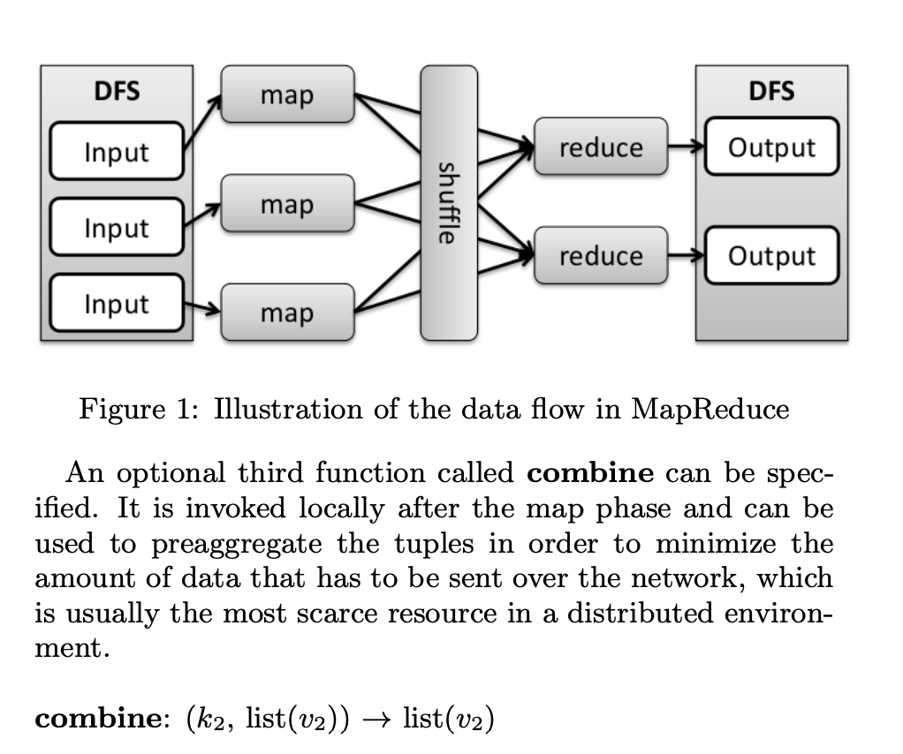
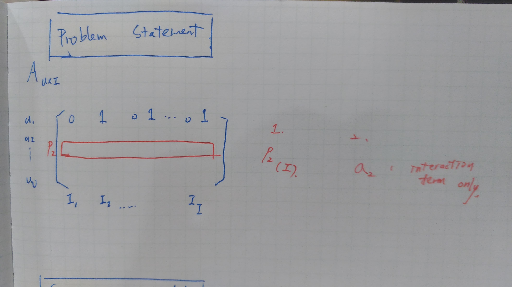
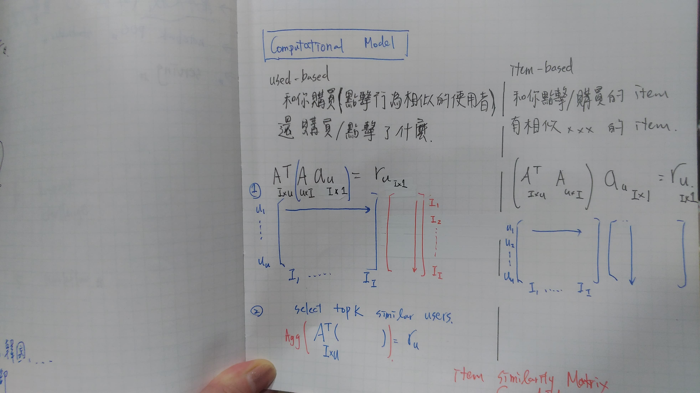
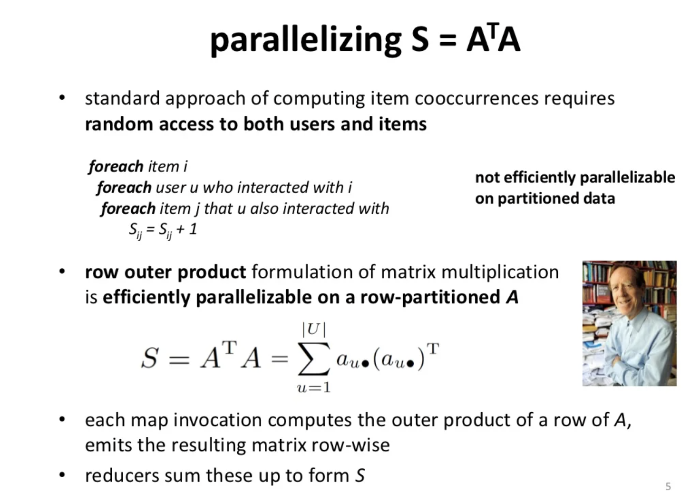
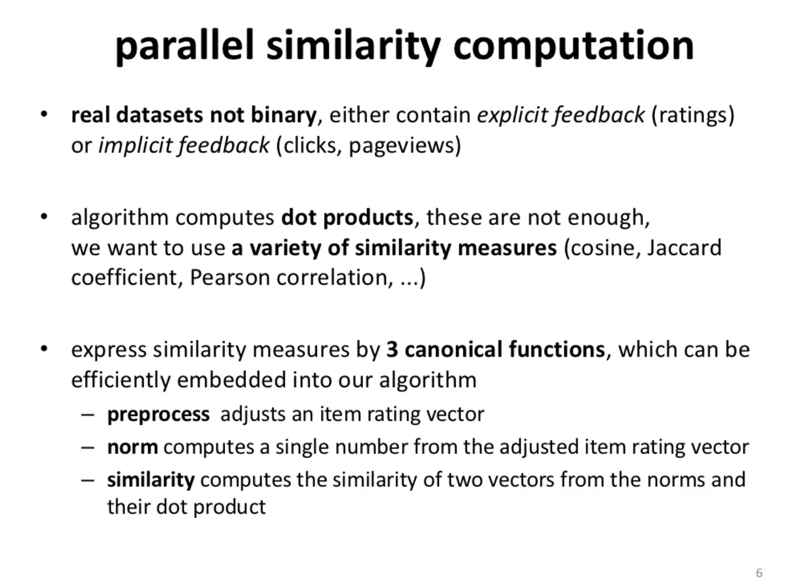
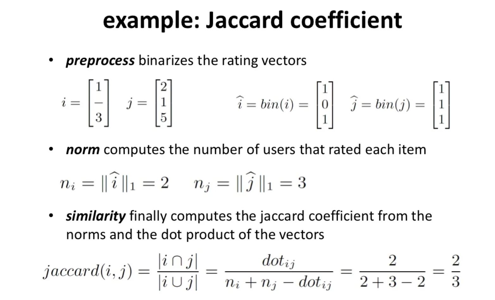
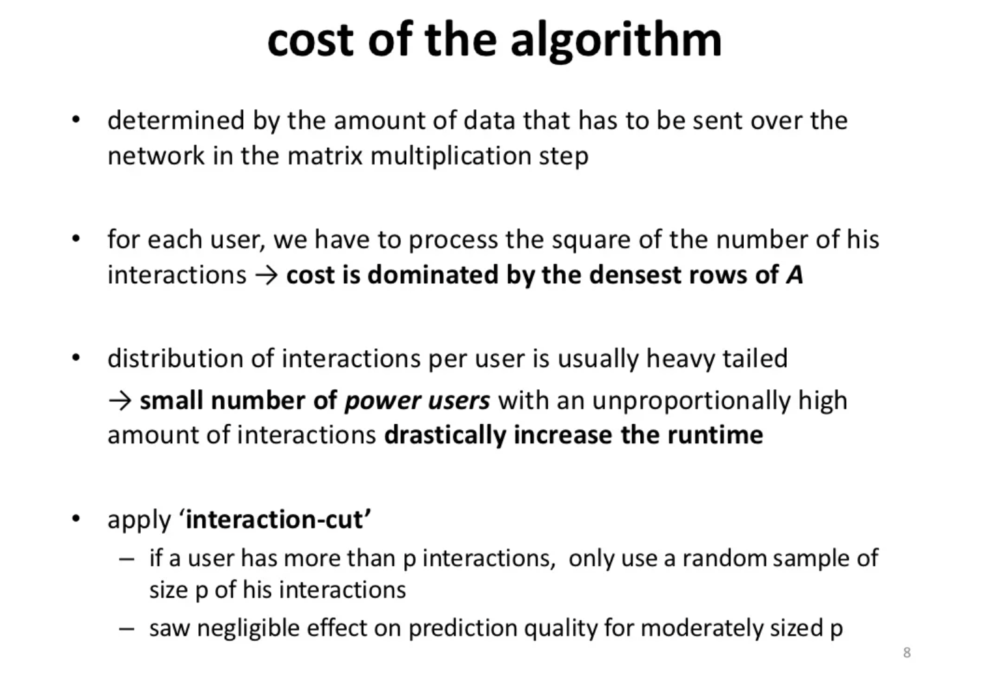
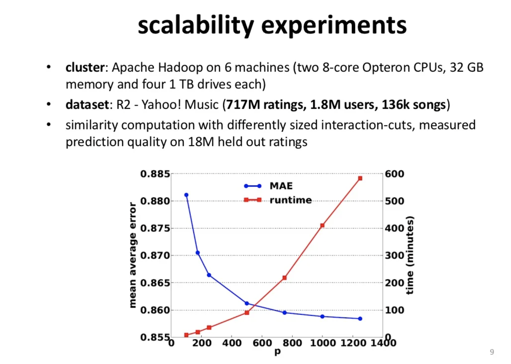
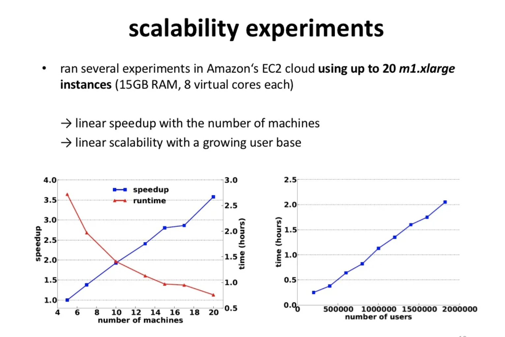

# Scalable similarity-based neighborhood methods with MapReduce

citations: 56 / ACM RecSys'12

year: 2012

[paper](https://www.researchgate.net/publication/235764839_Scalable_similarity-based_neighborhood_methods_with_MapReduce)

[github (Java)](https://github.com/dima-tuberlin/publications-ssnmm)

[linkedin slides](https://www.slideshare.net/sscdotopen/scalable-similaritybased-neighborhood-methods-with-mapreduce)

[connected paper](https://www.connectedpapers.com/main/3b0ab23fed87ea5632ae3a76111d0f1b708e786d/Scalable-similarity%20based-neighborhood-methods-with-MapReduce/graph)

benchmark - 7M songs from Yahoo Music

# Abstract

1. MapReduce Algorithm for pairwise item comparision and top-N recommendation problem that scales **lenearly** with respect to a growing number of users
2. parallel algorithm is able to work on partitioned daya and is general to supports a wide range on a large dataset of similarity measures.

# Introduction

1. algorithmic framework
2. variety of similarity measures in a highly efficient manners
3. selective down-sampling to handling heavy tailed distribution

## Map Reduce Algorithm

</img>

## Problem Statement

* interaction matrix : $A_{|U| \times |I|}$
* user $u$'s item history in interaction matrix : $a_{u}$ 
* all items according to how strongly they would be preferred by user $u$ : $p_{u}$

</img>

</img>

let's focus on item similarty computing.

## parallelizing $S_{|I| \times |I|}=A^{T}_{|I| \times |U|}A_{|U| \times |I|}$

</img>

* 調整成 row-wise ，可被平行化，但算法複雜度不變

</img>

</img>

* 把 similarity 拆成三個步驟

## Complexity Analysis 

</img>

* most denest rows of A 
  * most interaction (power user)
  * most popular item
  * ...
* apply sampling on `power users` / `popular items`
  * if more than $p$ interacrtions : random smaple of size p of interactions
  * negligible effect on prediction quality for moderately(適度地) sized p

# Experiments and Evaluation 

</img>

</img>

* suggestions : keep p ~ 750, MAE is slowing down.

# Other Discussion
