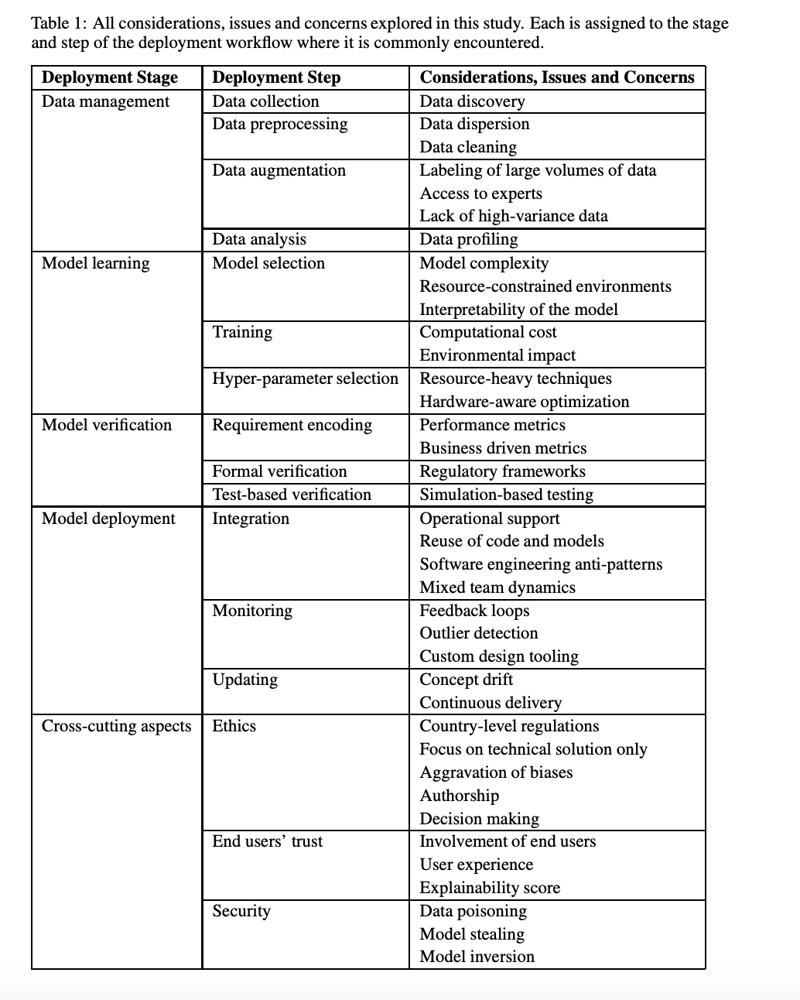

# Challenges in Deploying Machine Learning: a Survey of Case Studies

[paper](https://arxiv.org/pdf/2011.09926.pdf)

# abstract

1. They collect a lot of issues and concerns by stage of machine leaening model deployment
2. They provide use-case study

# content

</img>

# other-discussion
