# Brief Introduction of Random Walk-based Modeling

# 二分圖表示法(Bipartite Graph)

Record $(u, i)$ : 使用者$u$對物品$i$產生過行為，這樣的資料可以用一個二分圖表示

$G(V, E)$ : 使用者-物品二分圖

$V = V_{U} \bigcup V_{I}$ - 使用者頂點集合$V_{U}$和物品頂點$V_{I}$組成

$e_{v_{u}, v_{i}} = 1$ - 有產生互動行為

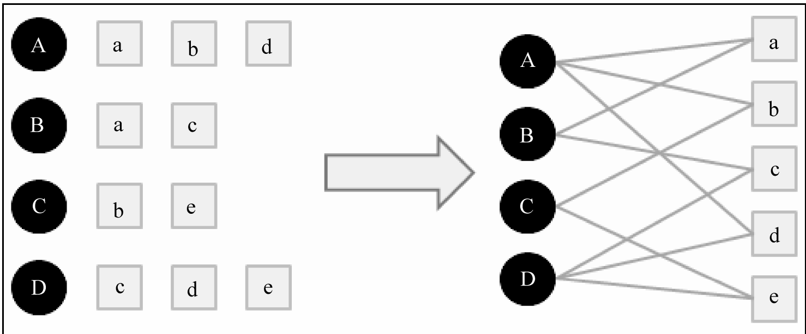</img>

普遍來說，在這種表示法的情況下，需要去量測兩個頂點之間的相關性，但大致上跑不出以下這幾種思路

1. 頂點之間路徑數

2. 頂點之間的路徑長度

3. 頂點之間經過的頂點數目

而相關性高的一對頂點一般都具有以下特徵

1. 兩個頂點之間有很多路徑相連
2. 連接兩個頂點之間的路徑長度都比較短
3. 連接兩個頂點之間的路徑不會經過out-degree較大的頂點

鄰接矩陣 $A$ : 為一個非對稱矩陣，表達了轉移機率

$$
v = \{v_A, v_B, v_C, v_D, v_a, v_b, v_c, v_d, v_e\}
$$

Meaning of value : row node goes out to column node.

**Normalized by out-degree(row)**

$$
A_{v \times v} = 
\begin{pmatrix} 0& 0 & 0 & 0 & \frac{1}{3} & \frac{1}{3} & 0 & \frac{1}{3} & 0
\\ 0 & 0 & 0 & 0 & \frac{1}{2} & 0 &  \frac{1}{2} & 0  & 0
\\ 0 & 0 & 0 & 0 & 0 &  \frac{1}{2} & 0  & 0 & \frac{1}{2}
\\ 0 & 0 & 0 & 0 & 0 &  0 & \frac{1}{3}  & \frac{1}{3} & \frac{1}{3}

\\ \frac{1}{2} & \frac{1}{2} & 0 & 0 & 0 &  0 & 0  & 0 & 0
\\ \frac{1}{2} & 0 & \frac{1}{2} & 0 & 0 &  0 & 0  & 0 & 0
\\ 0 & \frac{1}{2} & 0 & \frac{1}{2} & 0 &  0 & 0  & 0 & 0
\\ \frac{1}{2} & 0 & 0 & \frac{1}{2} & 0 &  0 & 0  & 0 & 0
\\ 0 & \frac{1}{2} & \frac{1}{2} & 0 & 0 &  0 & 0  & 0 & 0

\end{pmatrix}\quad
$$

## Topic-sensitive PageRank(2002) a.k.a. PersonalRank

[code : python](https://github.com/lpty/recommendation/blob/master/model/prank.py)

[book : 推薦系統實踐 - 項亮 2010](https://cdn-1253764997.cos.ap-chongqing.myqcloud.com//download/%E6%8E%A8%E8%8D%90%E7%B3%BB%E7%BB%9F%E5%AE%9E%E8%B7%B5.pdf)

benchmark : movielens-100M

假設要給使用者$u$進行個人化推薦，可以從使用者$u$對應的節點$v_{u}$開始進行隨機行走，由走到任何一個節點時，必須按照機率$\alpha$決定繼續走或是停止該次行走，並從$v_{u}$從新開始行走，如果決定繼續行走，那就隨機選擇一個有連接的邊，進入到下一個頂點，如此經過很多次隨機行走之後，每個物品節點被訪問到的機率就會收斂到一個數值，最終物品節點的訪問機率就是推薦排序

Psudo code

personalrank(user_i : int) -> item_distribution : Dict[int, int]

1. Start with user $u$ at vertex $v_{u}$
2. rec_item = {}
3. if random.random() > alpha:   

   random pick an edge and go to next vertex
   
   rec_item[item_idx] += 1

4. else:

   restart at $v_{u}$ 

5. repeat step2, step3, step4, K times
6. return rec_item

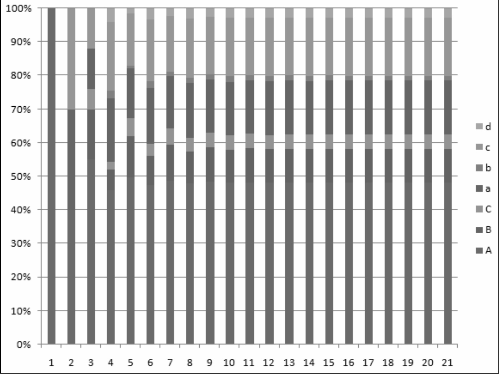</img>
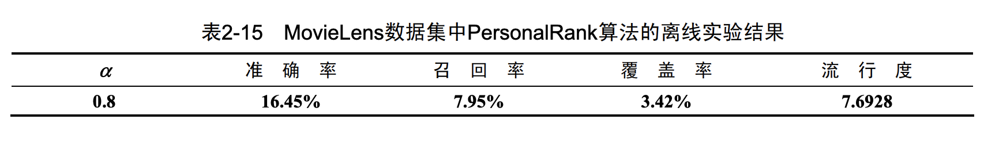</img>

## Asorption : Random Walk Through View Graph(2008, Shumeet Baluja, citation 540+)

[paper](https://dl.acm.org/doi/pdf/10.1145/1367497.1367618?casa_token=fd3ZjMMcdcIAAAAA:jD7FGKFX0m9zBMvUG3lWGrdZot7JL6eucg0dPS4CC1TPfxgkiWygVkgPZYYccUYopF0tRMlDPCvRdNM)

[code  : java, mapreudce on hahoop 2+ stars](https://github.com/natc221/AdsorptionMR)

benchmark : Youtube Private dataset.

## User-Video Graph

Bipartite Graph

## Asorption algorithm

user label propergation by graph data structure and random walk approach.

a labelling method when you have only a few user label.

## ItemRank: A Random-Walk Based Scoring Algorithm for Recommender Engines(2007, citations 300+, Marco Gori)

[paper](https://www.aaai.org/Papers/IJCAI/2007/IJCAI07-444.pdf)

code : N/A

benchmark : movielens(but weired metric)

Raondom walk on a **Item-Correlation Graph** build from User-Item interaction.

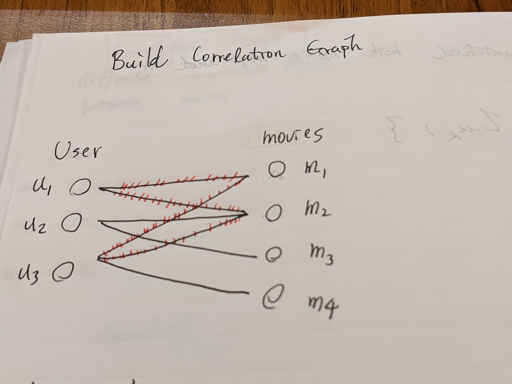</img>
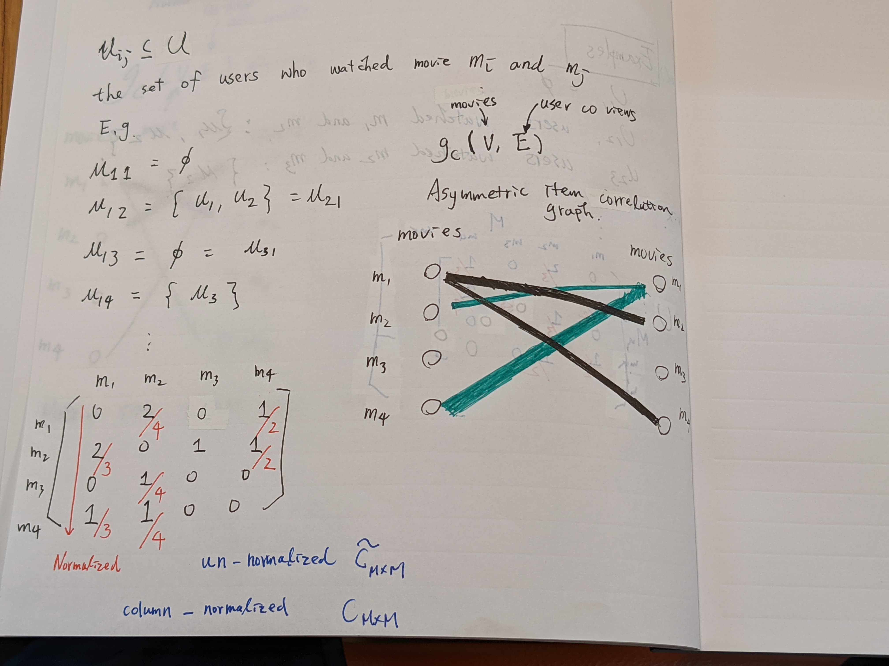</img>

## TriRank: Review-aware Explainable Recommendation by Modeling Aspects(2015, citation 250+ Xiangnan He)

[paper](http://www.cs.jhu.edu/~taochen/data/pubs/cikm15.pdf)

code : N/A

Add another information(item-meta information / reviews keywords)
user - aspects - items

benchmark : Yelp / Amazon

both benchmark has a cold - start problem

Yelp : 49.6% user only made one review

Amazon(electronics caegory) : 77.9% of users making only one review.

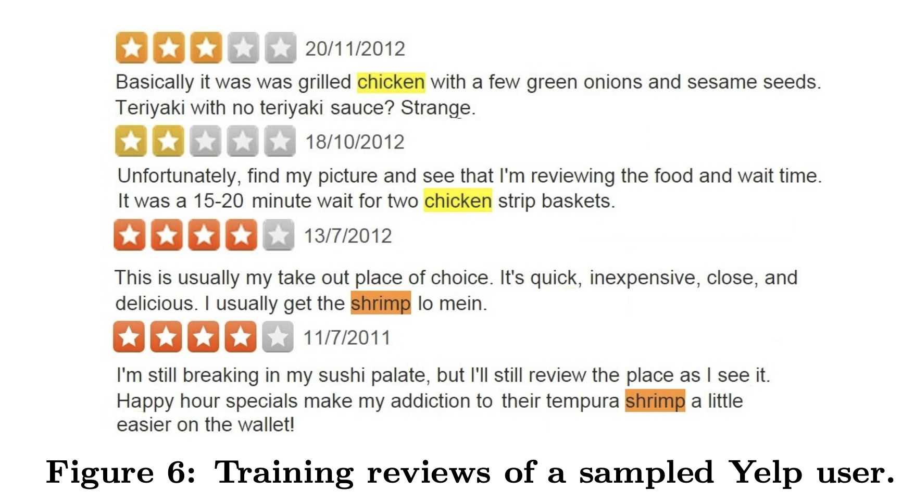</img>

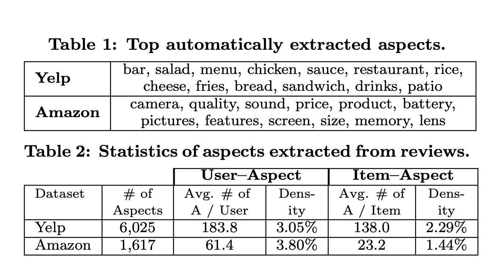</img>

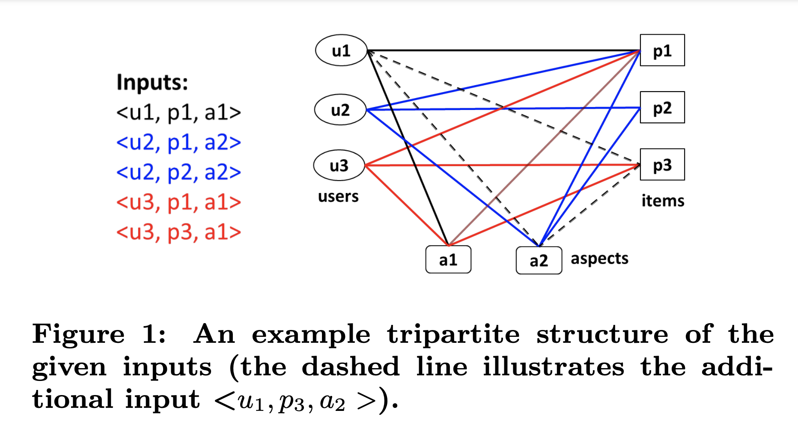</img>

Yelp : comment website

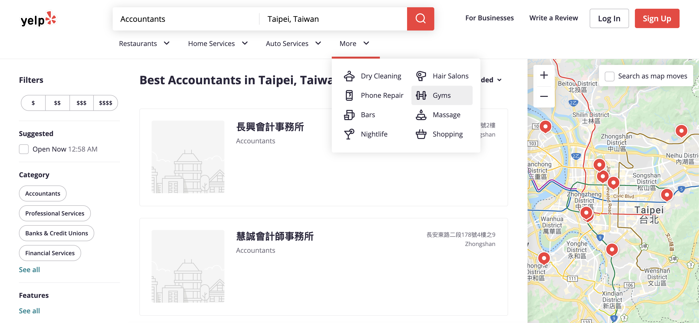</img>

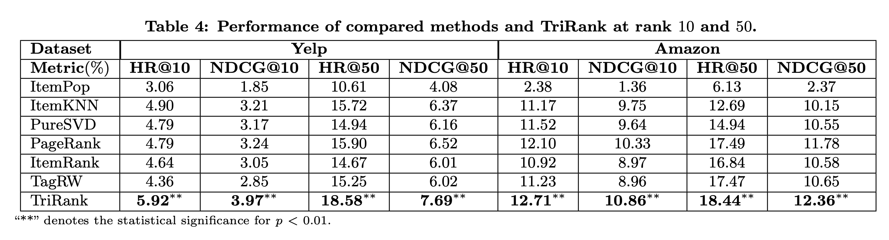</img>

1. use additional info to boost your recommendation.(we can use any insightful info as TriRank).
2. the cleaness of aspect matters.

## Pixie: A System for Recommending 3+ Billion Items to 200+ Million Users in Real-Time.(2018, citation 70+, Eksombatchai et al)

[paper](https://arxiv.org/pdf/1711.07601.pdf)

[code : rust, partitally implement star 5+](https://github.com/JD557/pixie-rust)

benchmark : pintrest private dataset.

3 billion nodes and 17 billion edges. 

pixnet : 0.8 billion articles, user counts in million scale.

single server : 1200 requests/second, 60 ms latency.

pin $p$ board $b$  : Bipartite Graph. (Not user-pin graph)

[connected papers](https://www.connectedpapers.com/main/b120a10310645df329c691b782dea9ceb7dfe786/Pixie-A-System-for-Recommending-3-Billion-Items-to-200-Million-Users-in-RealTime/graph)

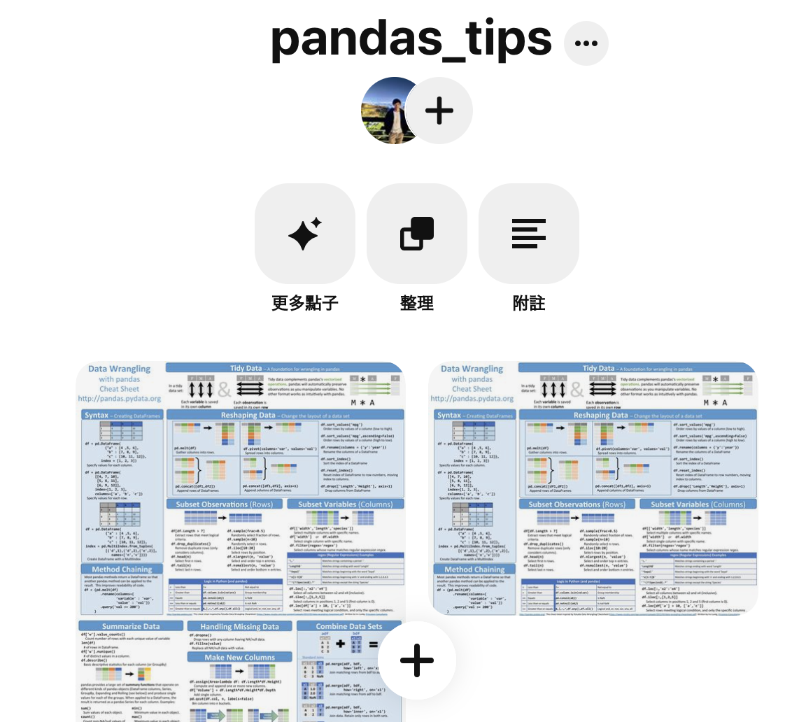</img>

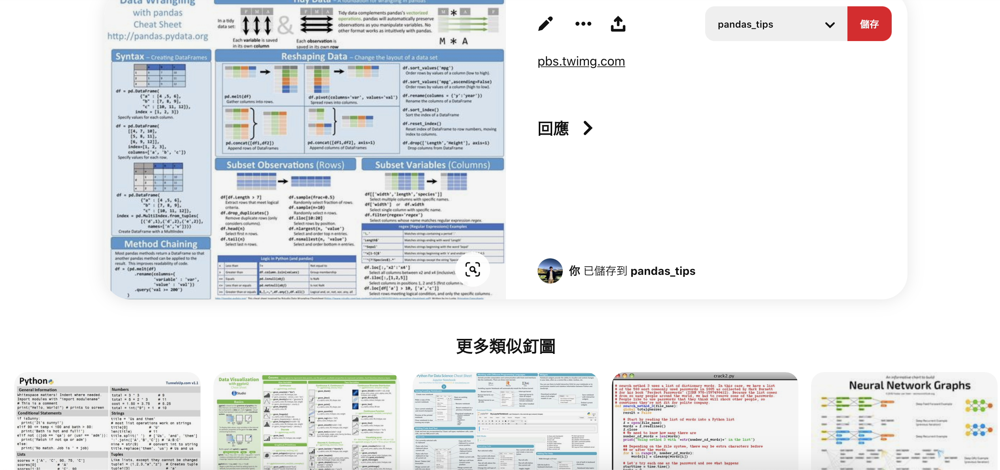</img>

**4 ways to improve basic random walk**

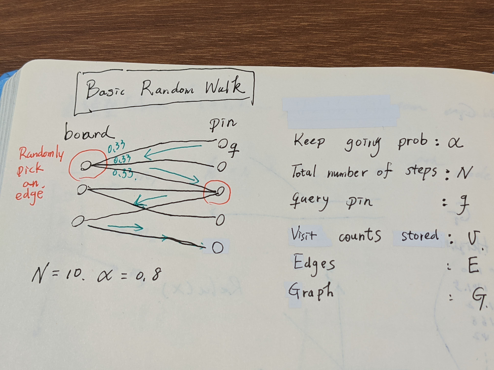</img>

1. Biasing the random walk. - we use board-pin graph, but we wanna involve user information in the current timesatemp. such like 

   * language the user current used.
   * topics the user liked(maybe from another tagging system)

   We biasing the random walk by changing the random edge selection to be biased based on user feature.

   In practice, this modifications turns out to be very important as it improves personalization, quality, and topicality.

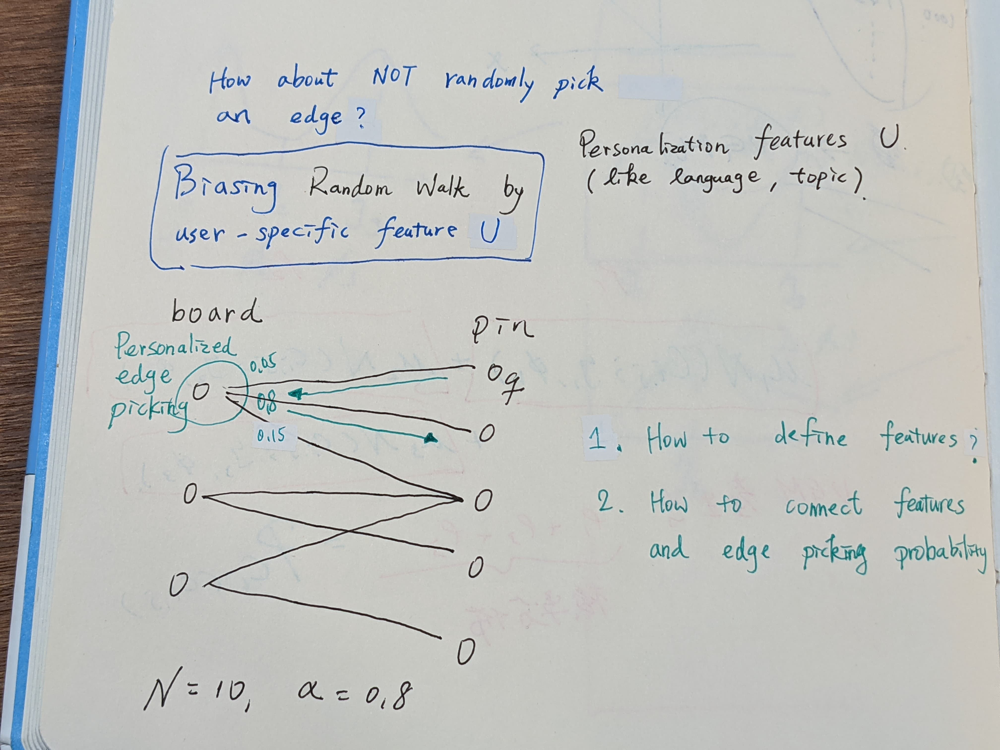</img>

2. Mulit-pins booster. - User hold a lot of pins with different board. Once user selected a pin, system get multiple user pins random-walk.

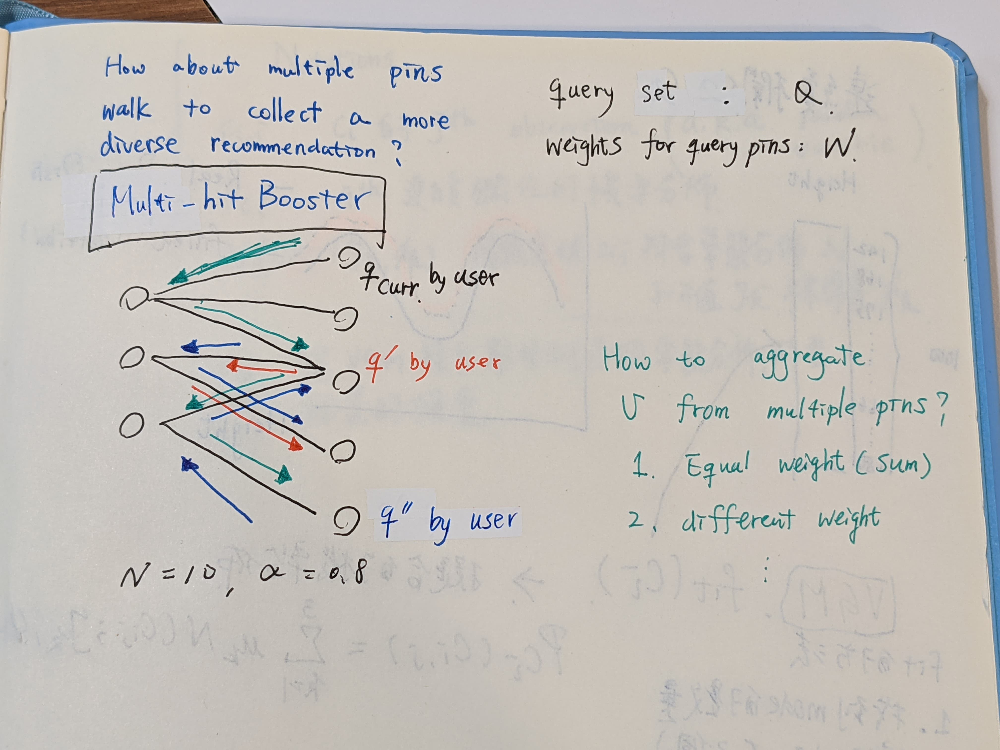</img>

3. early-stopping - we want our walk steps be efficient(as few but useful as possible.), defined a stopping criteria.
4. graph purning - not all boards on Pintrest are topically focus. prune the big graph into small graph.

Implement on the top of [Stanford Network Analysis Project](http://snap.stanford.edu/)

single terabyte-scale RAM machine.

[single sever with highest RAM wecan use on GCP ~ 0.7TB](https://cloud.google.com/compute/docs/machine-types)

## RecWalk: Nearly Uncoupled Random Walks for Top-N Recommendation(2019, citation 22+, Nikolakopoulos et al)

[paper](https://dl.acm.org/doi/pdf/10.1145/3289600.3291016?casa_token=FptgHIPh610AAAAA:695jSPFowSeeqZ_owl56h71XRz51_rnSTMthjv_cjXNuOQBK3kOVX1PDFda55YQsdvaBPWp6x1s)

[code : julia 15+ stars](https://github.com/nikolakopoulos/RecWalk)

[code : python 3+ stars](https://github.com/titoeb/RecModel)

benchmark : movielens, yahoo! R2Music, pintrest 

claim : RecWalk leverages the spectral properties of *nearly uncoupled Markov chains* to provably lift this limitation and prolong the infliuence of user's past preferneces on the seccessive steps of the walk.

We do actually achieve a significant improvement on 3 dataset above!

Randomwalk + ItemModel(proposed in SLIM)

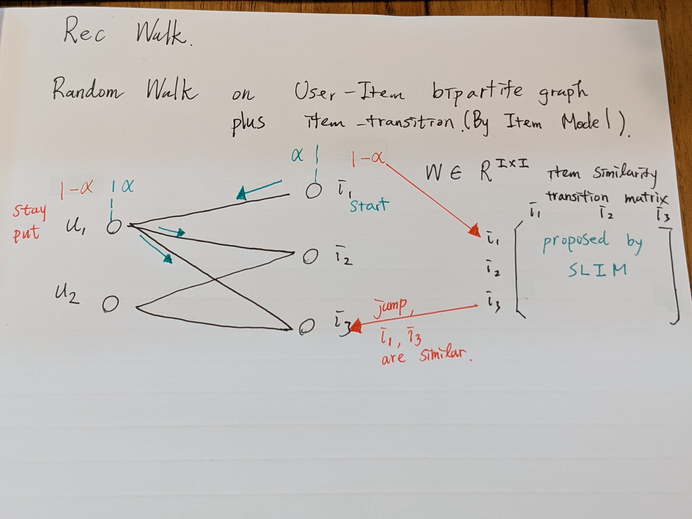</img>

## Summary

| Method              | Idea                                                        | Benchmark|Code|
|---------------------|-------------------------------------------------------------|----------|----|
| PersonalRank (2002) | introducing random walk into recommendation system |movielens | python 500+  |
|ItemRank(2007)|random walk on item co-viewed graph|movielens|N/A|
|Adsorption(2008), Youtube|1. user-item bipartie graph to propergate user information   2. node injection dirty work|private youtube dataset|Java, star 2+|
|TriPank(2015)|User-Item-Aspect Graph, might be useful for cold-start(more infos)|1. Open Yelp   2. Open Amazon|N/A|
|Pixie(2018)|involve user feature and multi-pins to achieve great engagement|pivate pintrest|Rust, star 5+, partially implementation|
|RecWalk(2019)|1. apply markov chain-related technique on random walk, achieve SOTA, significantly improve the result   2. User-Item graph plus item similarity transition matrix|1. movielens   2. Open yahoo! R2 Music   3. Open pintrest pin-board opend dataset|Julia, 15+   python 5+|

## Additional Reference

[WSDM 2020, recommendation system survey](https://next-nus.github.io/slides/tuto-cikm2019-public.pdf)
