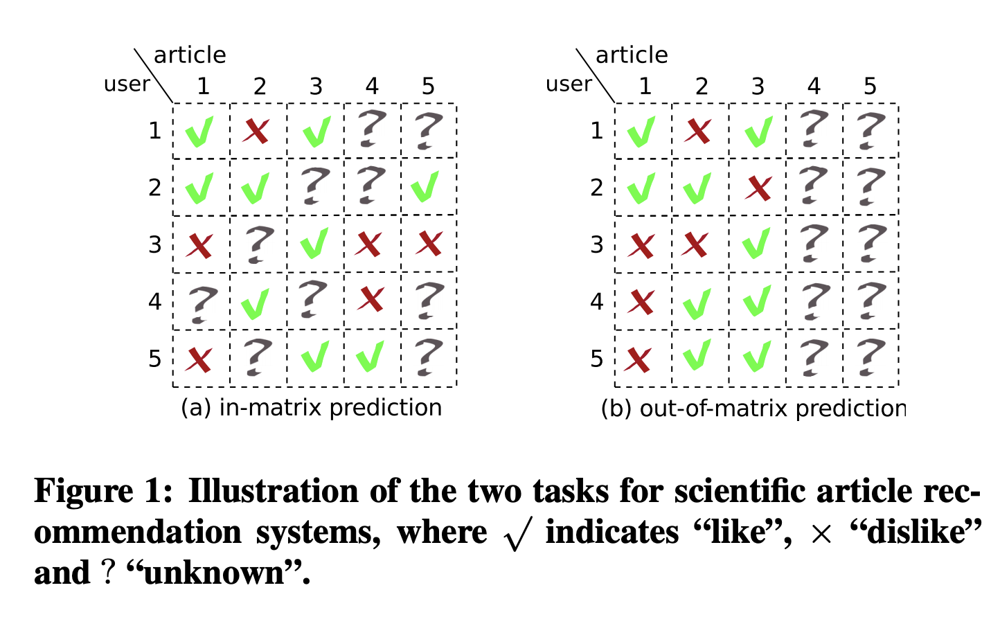
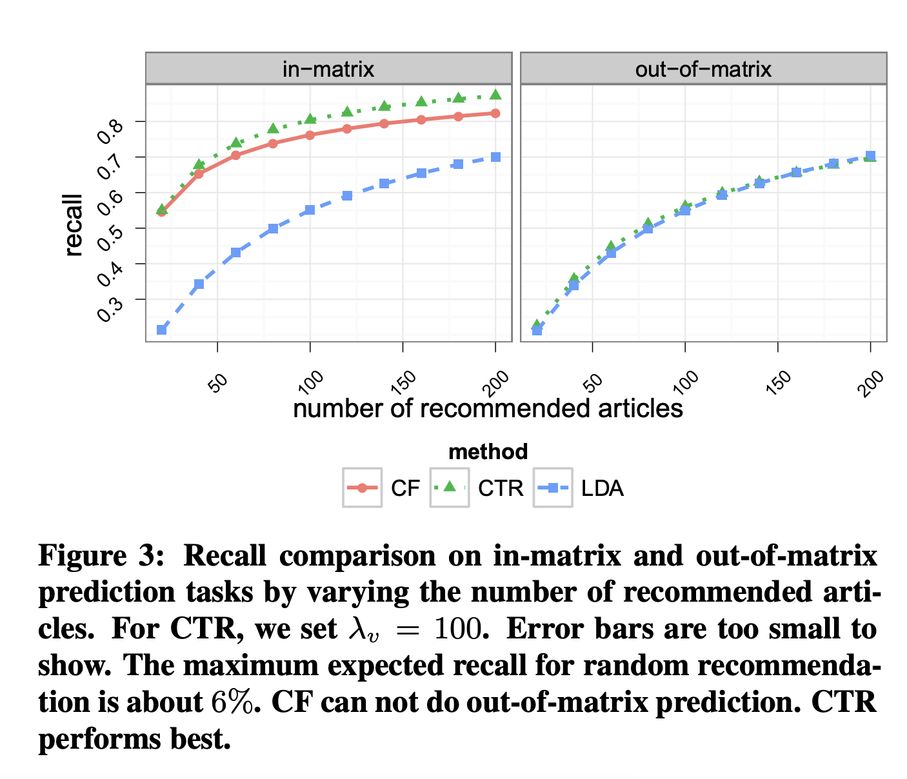
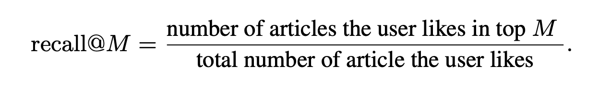
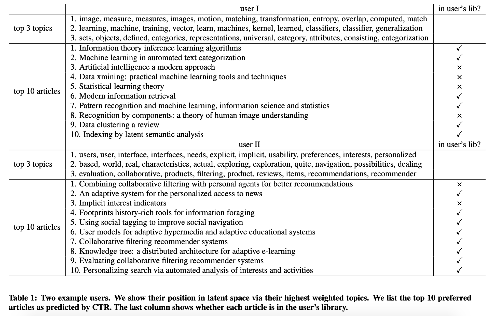

# Collaborative Topic Modeling for Recommending Scientific Articles

year : 2011
citation : 1658

[paper](http://www.cse.cuhk.edu.hk/irwin.king.new/_media/presentations/wangblei2011.pdf)

[code official C++](https://github.com/blei-lab/ctr)

[code - thirdparty - python](https://github.com/PreferredAI/cornac)

benchmark - CiteULike

CiteUlike(2004 ~ 2010):

1. registered create personal reference libraries
2. each article usually has a title and abstract

preprocessing:
1. merge duplicated articles
2. removed empty articles
3. filter user with fewer than 10 articles

stats of dataset:

---user-article pairs---

1. 5,551 users
2. 16,980 articles
3. 204,986 pairs
4. sparsity 99.8% --> high sparse
5. On average - 37 articles / per user

---copus---

document : concatenate title and abstract for each article

corpus : all documents

1. remove stop-word
2. select Top 8000 words by tfidf over corpus. -->  vocabulary set.

# Abstract
combine traiditiomal collaborative filtering and probabilistic topic modeling.

It provides an interpretable latent structure for user and items. and can form recommendations about both existing and newly published articles.

# Idea

## In-matrix prediction and Out-of-matrix prediction
</img>

In-matrix prediction : we can only predict the user-item ratings when the items that have been rated by at least one user in the system.

out-of-matrix-prediction : item 4 and 5 have never been rated (This is sometimes called **cold start problem**) whicn traiditional collaborative filtering algorothm cannot make predcitions.

## Recommendation by Matrix Factorization

## Probabilistic Topic Models

- used to discover a set of **topics** from a large collection of documents.
- topic distribution over terms
- interpretable low dimensional representation of documents.

LDA (latent Dirichlet allocation)

$k$ : Topics : $k=1, 2, ... K$

$j$ : itmes(articles) : $j=1,2,...J$

$N_{j}$ : words in each items(articles)

probability distribution : 

$K$ topics : $\beta = \beta_{1:K}$

articles : $w_{j}$

words(terms) : $n$

build topic model : 
For each article $w_{j}$

1. topic proportions $\theta_{j}$ ~ Dirichlet$(\alpha)$
2. For each word $n$
   1. Draw topic assignment $z_{jn}$~Mult$(\theta_{j})$
   2. Draw word $w_{jn}$ ~ Mult($\beta_{z_{jn}}$)

optimizer : variational EM

inference : variational inference

# Evaluation Procedure

# Result

</img>

</img>

</img>

# Other Discussion

[推荐系统有哪些比较好的论文？](https://www.zhihu.com/question/25566638/answer/112984019)

1. 嘗試解決冷啟動(混合user-item-rating matrix & Topic Modeling) - 至於解得好不好，要拿這些方法一起比較才準
2. 具推薦解釋性(by topic and words)

[Review the topic modeling from note](https://github.com/YLTsai0609/DataScience_Note/blob/master/Topic_Modeling_LDA.md)

[Review the multinominal distribution from note](https://github.com/YLTsai0609/DataScience_Note/blob/master/All_about_the_distribution.md)