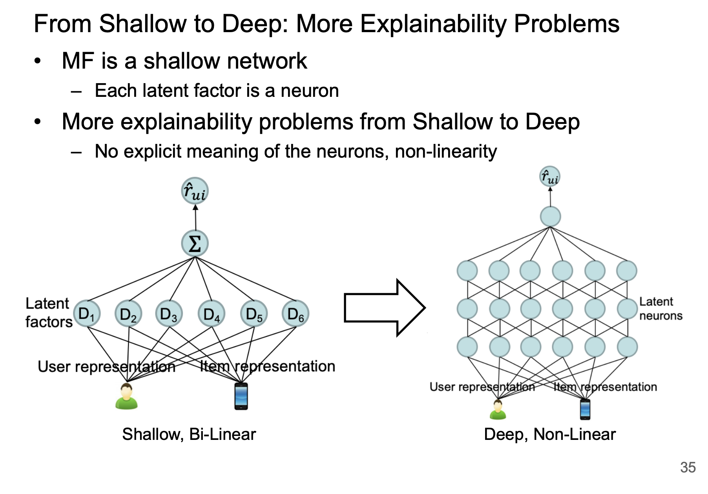

# Paper Title

citations: EARS 2019, Tutorial

year: 2019

[paper](http://yongfeng.me/attach/ears-tutorial.pdf)

[github N/A](link2)

benchmark - N/A

# Abstract

Survey Paper for Exaplainable Recommendation and Search

## 20220509

### Exaplainable vs Non-Exaplainable

</img>

</img>

</img>

</img>

</img>

</img>

</img>

</img>

</img>

</img>

Focus on User-Keyword-Item Facotrization Methods

# Result

# Evaluation Procedure

# Other Discussion
