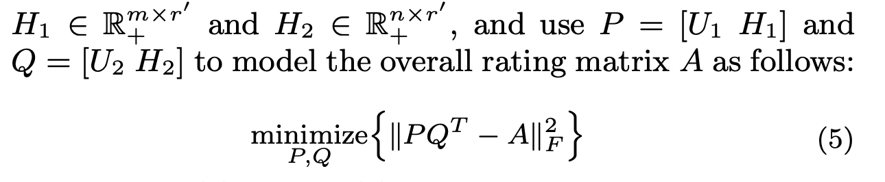

# Explicit Factor Models for Explainable Recommendation based on Phrase-level Sentiment Analysis

citations: 656

year: 2014

[paper](https://web.archive.org/web/20160729021611id_/http://www.thuir.cn/group/~YQLiu/publications/sigir2014.pdf)

[github from PerferredAI/cornac 500+ stars](https://github.com/PreferredAI/cornac/blob/master/examples/efm_example.py)

benchmark - Yelp / Dianping dataset (with reviews).

1. [yelp dataset](https://www.yelp.com/dataset) - restaurant search and review platform
2. [dianping dataset](https://lihui.info/data/dianping/) - restaurant search and review platform in China

# Abstract

# Result

# Evaluation Procedure

## Offline 

1. How do users care about the various explicit product features extracted from reviews.
2. performance on rating prediction / top-K recommendation

</img>

</img>

MP : Most Popular

SO : SlopeOne(neighborhood-based CF)

NMF : Non-negtive Matrix Factorization

BPRMF : (Bayesian Regularized Ranking (BPR) Optimization for MF)

HFT The SOTA(2014) in terms of making rating prediction with textual reviews.

$k$ is the number of most cared features in EFM. (hyperparameter)

</img>

## Online

## Recommendation Lisrt Explaination

1. A/B Testing
2. 1M users with 26% MAU
3. UI

</img>

4. select users who made 10+ reviews as target users
5. provide prediction bty EFM.

</img>

6. (A) experimental group : user receive feature-level explanation
7. (B) comparision group : user receive the famous `People also viewed` explanation
8. (C) control group : user receive no explanation
9. A+B+C : 44k records, 944 commom items. (all the prediction generated from EFM)

</img>

10. ten-fold t-test : CTR of group A is significantly higher than B and C.

# Theorem

</img>

corpus : extract from review(yelp, dianping)

</img>

$X \in R^{m \times p}$ : user-feature attention matrix - each element measures to what an extent a user care about (sparse).

* $m$ users
* $p$ product features/aspects

$Y \in R^{n \times p}$ : item-feature quality matrix  - each element measures the quality of an item for the product feature/aspect.

* $n$ items

$A \in R^{m \times n}$ : user-item numerical rating matrix.

</img>

* $r$ : explicit factors (dimension reduction of users, items, and product features)

* the authors (who publish the paper) thinks explicit factors might not be able to fully explain a rating and a user might consider some other hidden factors when making a decision.
* so they concat a latent factor with explicit factor

</img>

* the objective func

</img>

## Learning

</img>

extend ALS to multiple parameters.

## Prediction

after learning : 

we can generate ant missing element in 

$X$(user-feature attention matrix)

$Y$(item-feature quality matrix)

$A$(use-item prediction)

## Top-K Recommendation

* for user $u_{i}, i \in \{1, m\}$, $ick most cared features $k$ in $X$
* elementwise product the item quality matrix $Y$
* also offer a parameter $\alpha$ : the scale control the trade off between feature based score and direct user-item ratings.

## Personalized Feature-Level Explaination.

</img>

* pick matching item quality
* e.g.
* $u_{i}$ cares about 
  * 1st - quality
  * 2nd - brand
* item list
  * since you care about brand , the item belong to brand `Apple`
  * since you care about quality , the item is a `high quality, xxx`

# Other Discussion

1. only used when 10+ reviews - capture long term user - feature attention?