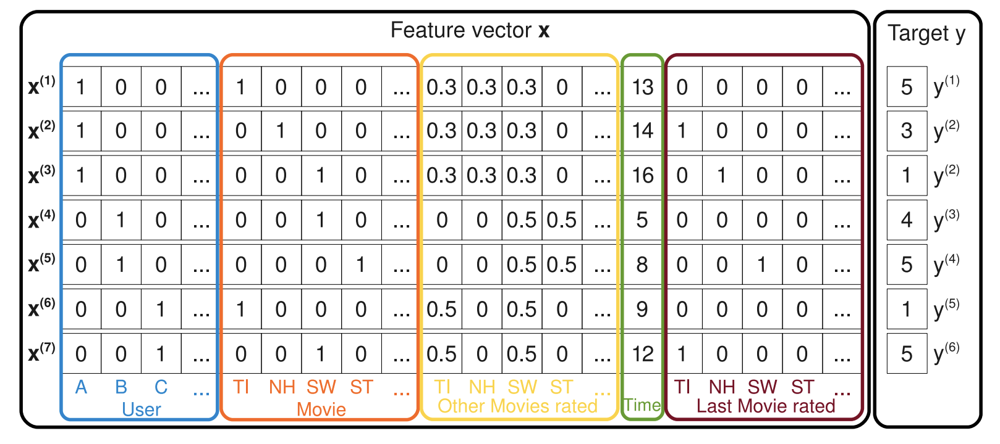

# Factorization Machines

[paper](https://www.csie.ntu.edu.tw/~b97053/paper/Rendle2010FM.pdf)

[github pyFM](https://github.com/coreylynch/pyFM)

[github tffm](https://github.com/geffy/tffm)

It has been a while, the paper is published on 2010.

# Abstract

1. combine the advantages of SVM with factorlizationm models
2. FM model all interactions between variables using factorized parameters.
3. FM is able to estimate interactions with huge sparsity.
4. FM can be calculated in linear time.
5. FM can easily apply without expert knowledge.
6. FM can mimic these models(matrix factorization, parallel factor analysis or specialized models like SVD++, PITF, FPMC)

# Idea

## Describe the problem

target domain :  $T$

training dataset $D = \{(x^{(1)}, y^{(1)}), \{(x^{(2)}, y^{(2)}), ...\}$

| task           | target domain  |   feature domain |note|
|----------------|----------------|------------------|----|
| regression     | $T = \R$       |   $X \in R^{n}$  ||
| classification | $T = \{+, -\}$ |   $X \in R^{n}$  ||
| ranking        | $T = \R$       |   $(x^{(A)}, x^{(B)}) \in D$  |1. $x^{(A)}$ should be randked higher than $x^{(B)}$   2. pairwise training data|

Though the pairwise ranking relation is antisysmmetric, it is sufficient to use only positive training instances.

## Sparse data

$X$ is highly sparse. Almost all of the elements $x_{i}$ of a vector $x$ are zero.

$m(x)$ - the number of non-zero elements in the feature vector $x$.

$\bar{m}_{D}$ - the average nunmber of non-zero elements $m(x)$ of all vectors $x \in D$.

huge sparsity ($\bar{m}_D << n$)

1. event transactions
2. purchases in recommender systems
3. text analysis(bag of word approach)

basically, large categorical variable domains.

## Example

movie review system 

user $u \in U$ rates a movie(item) $i \in I$ at a certian time $t \in \R$ with a rating $r \in \{1, 2, 3, 4, 5\}$. Let users $U$ and items $I$ be :

$U=$ {Alice(A), Bob(B), Charlie (C), ...}

$I=$ {Titanic(Ti), Notting Hill(NH), Star Wars (SW), Star Trek(ST), ...}

observed data $S(u, i, t, r)$ : 

$S$ = {(A, TI, 2010-1, 5), (A, NH, 2010-2, 3), (A, SW, 2010-4, 1), 
(B, SW, 2009-5, 4), (B, ST, 2009-8, 5), 
(C, TI, 2009-9, 1), (C, SW, 2009-12, 5)}

The expanding one-hot encoding dataframe will look like:

</img>

| color | meaning         | 
|-------|-----------------|
| blue  | the active user |
| red   | the active item |
| yellow   | other movies the user has rated(implicit infor) |
| green   | time (month in this case) |
|brown|last movie the user has rate before the active one

1. $x^{(i)}$ will be event-wise vector
2. $y^{(i)}$target here is rating
3. the yellow part : normalized each record to 1
4. task : estimate a function $\hat{y}(x)$ that predicts the rating behaviour of a user for an item at a certain point in time.

## Factorization Machines

feature component : $x_{i}$

where $i \in \{1, 2, ... n\}$

facotrlization machine of degree $d=2$：

$$
\hat{y}(x) := w_{0} + \sum_{i=1}^{n}w_{i}x_{i} + \sum_{i=1}^{n} \sum_{j=i+1}^{n} \hat{w}_{i, j}x_{i}x_{j}
$$

1. $w_{0}$ - global bias
2. $w_{i}$ - the strenth of $i^{th}$ feature component
3. $\hat{w}_{i,j}$ - the strength of $i, j$ interaction pair. Instead of using an own model parameter $w_{i, j} \in \R$ for each interaction, the FM models the interaction by **factorizing it**. This is the key which allows high quality parameter estimate of high-order interactions $d \geq 2$ inder sparsity.

$$\hat{w}_{i, j} := <v_{i}, v_{j}>$$

$$<v_{i}, v_{j}> := \sum_{f=1}^{k}v_{i, f} \sdot v_{j, f}$$

$$w_{0} \in \R, ~~~ w \in \R^{n}, ~~~ V \in \R^{n\times k}$$

1. A row $v_{i}$ with $V$ describe the $i$ th feature component with $k$ factors. 
2. $k \in \N_{0}^{+}$ is a hyperparameters that defines the dimensionality of the factorization.
3. matrix factorlization : It's well known that for any positive define matrix $W$, there exists a matrix $V$ such that 

$$
W = V \sdot V^{T}
$$

This shows that a FM can express any interaction matrix $W$ if $k$ is chosen large enough. **Nevertheless in sparse serrtings, typically a small $k$** should be chosen because there is not enough data to estimate complex interactions. Also, restricting $k$ leads to better generalization and improved interaction matrices under sparsity.

## Parameter Estimation Under Sparsity

1. not enough data to estimate interactions (size of data < size of feature dimensions)
2. facotrlization can do that because they break the independence of interaction parameters by facotrlizing them

### Math hack

original fm equation : $O(k n^{2})$ because all pariwise interactions have to be computed.

let's rewrite equation and get the magic linear time compleixty $O(kn)$

**mathematical derivation**

$\sum_{i=1}^{n} \sum_{j=i+1}^{n} <v_{i}, v_{j}>x_{i}x_{j}$ - upper trangle interaction term, time coplexity $O(kn^{2})$

$= \frac{1}{2} \sum_{i=1}^{n} \sum_{j=1}^{n} <v_{i}, v_{j}>x_{i}x_{j} - \frac{1}{2} \sum_{i}^{n} <v_i, v_i> x_i x_i$ - $\frac{1}{2}$ (whole matrix - diagonal term)

$= \frac{1}{2} (\sum_{i=1}^{n} \sum_{j=1}^{n}\sum_{f=1}^{k}v_{i, f}v_{j, f} x_i x_j - \sum_{i}^{n} \sum_{f=1}^{k}v_{i, f}v_{i, f} x_i x_i)$ - expand the factor term

$=\frac{1}{2} \sum_{f=1}^{k}((\sum_{i=1}^{n}v_{i, f}x_i)(\sum_{j=1}^{n}v_{j, f}x_j)- \sum_{i=1}^{n}v_{i, f}^{2}x_{i}^{2})$ - take out the factor sum

$=\frac{1}{2}\sum_{f=1}^{k}((\sum_{i=1}^{n}v_{i, f}x_i)^{2} - \sum_{i=1}^{n}v^{2}_{i, f}x_{i}^{2})$ - combine the same term sum_i and sum_j with square - Time complexity $O(kn)$

### computational trick

Moreover, under sparsity most of element in $x$ are 0 (i.e. $m(x)$ is small). meaning?

Menas that we have only computed over the non-zero elements. the computation of facotrization machine is in $O(k\bar{m}_{D})$. where $\bar{m}_{D}$ is the average nunmber of non-zero element $m(x)$ of all vector $x \in D$

## Learning Factorization Machines

$$
u(x) = 
  \begin{cases} 

      1, & \text{if } \theta \text{ is } w_0 

   \\ x_i, & \text{if } \theta \text{ is } w_i 
   \\ x_i \sum_{j=1}^{n}v_{j, f}x_{j} - v_{i, f}x^{2}_{i}, & \text{if } \theta \text{ is } v_{i, f}
  \end{cases}
$$

**The sum $\sum_{j=1}^{n}v_{j, f}x_{j}$ is independent of $i$ which can be precomputed**

In general, each gradient can be computed in contant time $O(1)$. all parameter updates for a case $(x, y)$ can be done in $O(kn)$ or $O(km(x))$ under sparisity

## d-way Factorization machine

we can easily generalize our equeation to d-term interaction =)

## Compare to Matrix Factorization

Matrix factorization(MF) usually factorizae a relationship **between two categorical variables(e.g. $U$ and $I$)**.

FM using the feature vector $x$ and compute the non-zero element with any number of categorical vavirables.

# Other Discussion

1. linear model - not good enough
2. add interaction term - good, but overfitting and spend a long time.
3. factorization machine - reduce time complexity by involving matrix factorization hack.
4. physical meaning of factorization machine? (or matrix factorization?)

# Misc

1. $R^{n}$ - n dimensional real number space，[check wiki](https://zh.wikipedia.org/wiki/%E6%AC%A7%E5%87%A0%E9%87%8C%E5%BE%97%E7%A9%BA%E9%97%B4)

2. $R^{n \times k}$ - n x k dimension real nuber space (matrix)
3. $\N_{0}^{+}$ - non zero nature number [1, 2, 3, ...], [check wiki](https://zh.wikipedia.org/wiki/%E8%87%AA%E7%84%B6%E6%95%B0)
4. $:=$  - 從電腦科學界過來的符號，意思是左式由右式定義 check [this](https://math.stackexchange.com/questions/25214/what-does-mean)

# Stats

1. intro and problem description 1.5HR
2. refine math(description), factorization machine definition, math hack (1/3) 2.5HR

3. math hack, learning fm 1HR
