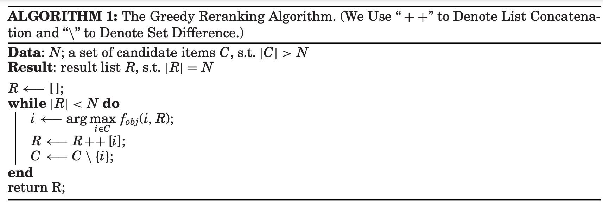
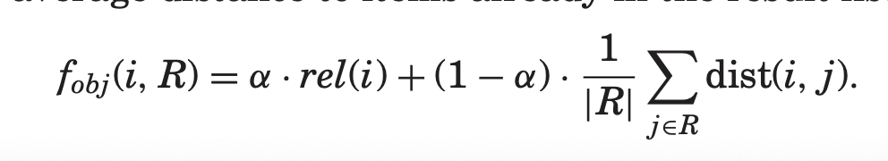

# Diversity, Serendipity, Novelty, and Coverage: A Survey and Empirical Analysis of Beyond-Accuracy Objectives in Recommender Systems

citations: 200+

year: 2017

[paper](http://old-eclass.uop.gr/modules/document/file.php/DIT104/%CE%92%CE%B9%CE%B2%CE%BB%CE%B9%CE%BF%CE%B3%CF%81%CE%B1%CF%86%CE%AF%CE%B1%202017-2018/Diversity%2C%20Serendipity%2C%20Novelty%2C%20and%20Coverage.pdf)

github - N/A

benchmark - N/A

[Connected Paper](https://www.connectedpapers.com/main/f59605273fb4bf12bc71f2ea300bbd8b5afe6fd6/Novelty-and-diversity-enhancement-and-evaluation-in-recommender-systems-and-information-retrieval/graph)

# Abstract

What makes good recoomendation beyond accuray?

1. diversity(列表多樣性)
2. serendipity(列表驚喜度 - 對於使用者而言)
3. novelty(列表新穎度)
4. coverage(列表覆蓋度)

offline experiments for reranking optimization for 4 metrics.

some insights, e.g. 

1. rating based diversity is positively correlated with novelty.

2. positive influence of novelty on recommendation coverage.

Overall

Maximize accuracy 

s.t.

coverage > A

diversity > B

novelty > C

# Detail
## Diversity

1. idea comes from information retrieval research.
2. Smyth and McClave [2001] - measuring diversity of a recommendation list $R$, $|R| > 1$ as average pairwise distance between items in the list (widely used in the RS literature)

$Diversity(R) = \frac{\sum_{i \in R} \sum_{j \in R, j != i} dist(i, j)}{|R|(|R| - 1)}$

$d_{i, j} \in [0, 1] = 1 - s_{i, j}$

$s_{i,j}$ is the similarity of items $i, j$

e.g.

$d_{ij}$ in $D$, $|R| = 3$

$$
D_{3 \times 3} = \begin{pmatrix} 
   1 & 0.2 & 0.2 
\\ 0.2 & 1 & 0.3
\\ 0.2 & 0.3 & 1
\end{pmatrix}\quad
$$

Diversity = $\frac{2*(0.2+0.2+0.3)}{3x2} = 0.23$

1. Jaccard similarity, cosine similarity, hamming distance, pearson correlation could be used to compute the distance.
2. item distance can also be obtained from the latent feature vector in matrix factorization approaches.
3. The balance between the diversity and accuracy of results is a widely discussed
topic in information retrieval and recommender systems research.
4. helps user experience (i.e. maximize revenue in single session.)

## Increaing Diversity.

1. Most diversification tech in RS and IR literature are based on reranking the result lists generated by existing recommendation (and retrieval) algorithms to increase their diversity while maintain relevance.

2. Another group of approaches - define new models for diversity-oreented recommendation.

### Reranking

</img>

simple approach : linear combination of item's relevance and negtive of its maximum similarity to items already in the result list.

avg dist in result list:

</img>

Recent work on recommendation reranking for diversity has focused on designing more advance objective functions that combine item relevance and diversity.

### Diversity Modeling

1. directly optimize for diversity when generating recommendations.
2. e.g. [Shi et al. [2012] combined matrix factorziation with the portfolio theory (diveristy-aware matrix factorization blablabla.)](http://web4.cs.ucl.ac.uk/staff/jun.wang/papers/2012-sigir-lfp.pdf)

## Novelty(新穎度)

1. closely related to serendipity(驚喜度)
2. the definition of novelty in the RS literature is inspired by IR research. Baeza-Yates and Ribeiro-Neto [1999] were among the first to discuss novelty as an important quality in information retrieval.
3. an itme's novelty is approximated using its popularity among users of the recommender system. - the less popular an item is, the more likely it is to be unkown to the user.
4. novelty  is typically defined as the complement of the item's popularity in the dataset : $1-p(i)$, where $p(i) = \frac{|u\in U,  r_{ui} \neq \emptyset|}{|U|}$ is the fraction of users who rated item $i$
5. a slight variation to define novelty as the negtive of the log of the ratio $-logp(i)$ - this formulation is called the self-unformation of an item $i$
6. **helps user experiences**
7. **item provider should care this metrics.**

the novelty of individual recommendations is aggregated into a single score for a list of recommendations $R$

$Novelty(R) = \frac{\sum_{i \in R}-log_{2}p(i)}{|R|}$

novel items are identified with the long tail items (the part of item catalog seen by a small part of the user community)

6. detailed analysis was given by Celma[2009]
   1. long-tail item distribution and its relation to item similarity to a music recommendaer.
   2. item-based CF (similarity defiend by user views)and content-based (CB) approach(similarity defined by content)
   3. CF item graph - for popular items tend to form highly interconnected cluster in graph means the long tail (novel) items are diffcult to reach and therefor difficult to recommend to user.
   4. CB item graph - item connections in the graph are independent of their popularity, therefore making CN recommendations more novelty oriented.

## Increasing Novelty

focus on works that increase recommendarion novelty by promoting rare items(long tail items)

Some early study : 
1. improving rating prediction accuract for long-tail items in Movielens(Park and Tuzhilin[2008]) - since prediction accuracy for rare items is lower than for popular items 
   * proposed solution - clustering the long-tail items to creating joint rating profiles for the clusters.
   * did not guarantee pronotion of the long-tail items into top-N recommendation list.

2. weight spreading in a biparite user-item graph
   * increasing diveristy and novelty. 

## Coverage

1. the fraction of items that appear in the user's recommendation list
2. so called catalog coverage, is different from prediction coverage(serving coverage)
3. **content-provider care this metrics**
4. can consider freq, not only union of items.

$Coverage = \frac{\bigcup_{u \in U} R_{u}}{|I|}$

$R_{u}$ is the set of all recommendations generated for user $u$, $U$ is the set of all users of the system, I is the item catalog.

## Increasing Coverage

1. linked to the novelty of recommendation - novelty and coverage are highly correlated.
2. reducing populairty bias is the key.

pass

# Result 

# Evaluation Procedure

# Other Discussion
