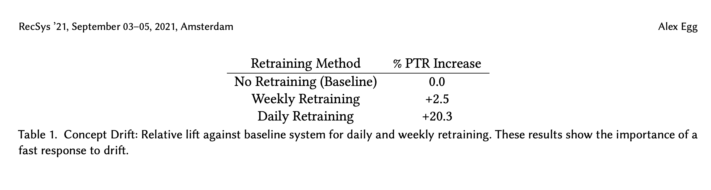
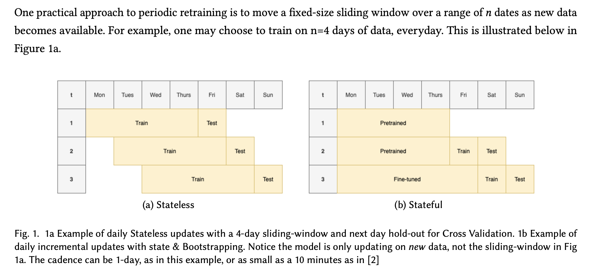
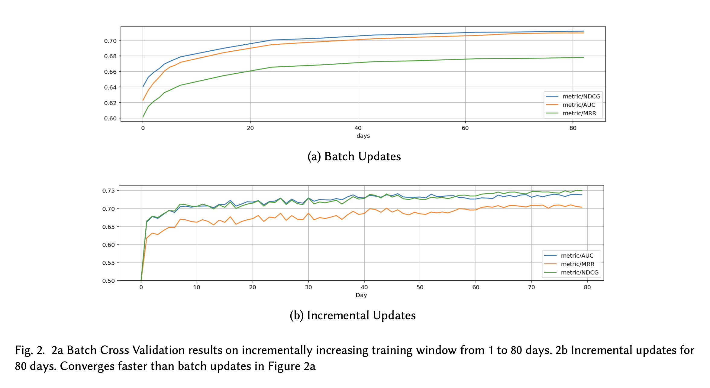
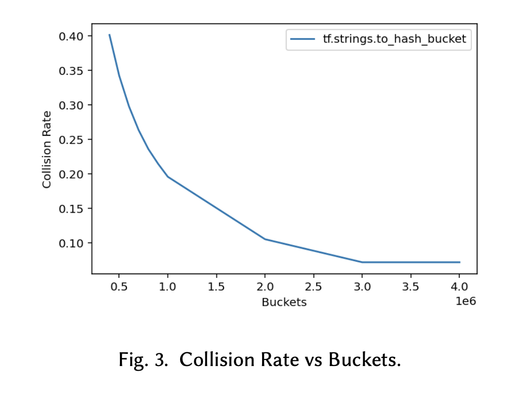
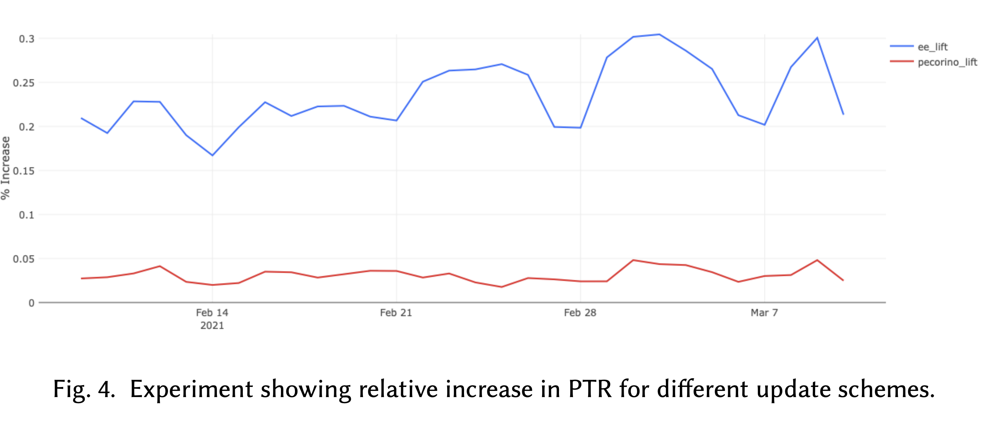

# Online Learning for Recommendations at Grubhub

citations: 2

year: 2021

[paper](https://arxiv.org/pdf/2107.07106v1.pdf)

[github](link2)

benchmark - 

# Abstract

online learning leverage transfer learning
   1. quality - updated frequently online can adapt to concept drift faster than a btach system, especially true for user - interaction system like recommenders where the underlying distribution can shift drastically to follow user behavior
   2. scalability -  a shift from stateless batch learning offline to stateful incrememental learnning lift 45x cost saving and +20% metrics increase at **Grubhub**
   3. few challenges
      1. convergence
      2. non-stationary embeddings
      3. off-policy evaliation
      4. **cannot be paralleized**

## Introduction

1. Recommendation drive 80% of revenue @ Grubhub, quality of recommender system is very important
2. Concept Drifting @ Grubhub
3. PTR (Purchase Through Rate)

### Retraining for data drifting

</img>

4. table shows the drift affects business metrics, motivates and necessitates not just model retraining, but frequent model retraining to allow our system rapidly adapt to data distribution changes

</img>

5. consider n days sliding window, we can theoreticallyachieve $n$ x times and cost saving
   1. figure 1a, 4x coast savings
   2. 2021, p3.8xl on AWS costs $12/hour, retraining job @ Grubhub takes about 3 hours to learn on 30 days of data, we can save 30x costs using trained model and transfer learning tech.

### Stateful updates

1. above the framework, training job depends on the model @ $n-1$ stage.

2. transfer learning is OK applys on parametric models (such as NN), but NOT OK for trees algorithm - check reference [1]

3. experiments - 
   1. batch retrain, days from 1 to 80 days
   2. incremental updates for 80 days
   3. Incremental updates model **converges faster**

</img>

### off-policy evaluation & pretraining

1. in cv pretrained -- fune tune
2. borrow this to recommendation
   1. training offline until convergence
   2. fine-tuning online to rapidly adapt for drift.
   3. log data can be leveraged for pre-training which allows us to back-test the model offline

### Embedding in online learning

1. vocabularies that map categorical features to an interger index in an embedding require advanced knowledge of all possible categories --> unfeasible in ecomm/product settings where products/resuaurants come and go in realtime.
2. hash non-stationary categories to a hashmap given inputs from $1$ to $n$ buckets.
3. challenge is tune $n$ with repect to an acceptable collision rate. - use double hashing tech [4]
4. @Grubhub, sizing 500k to 4M buckets to measure collision rate.
   1. they assured they can represent most resuaurants in the world, and can adapt to new restaurants online, without full retraining
   2. sacrifice the hashing is no way to compute the inverse transform which can be a problem when trying to introspect which feartures are important to a model.

</img>

# Result

* experiments
  * blue - stateful transfer-learning
    * +20% PTR increase
    * -45x cost
    * saving hundreds of thousands of dollars annaually
  * red - batch (daily) training
  
</img>

