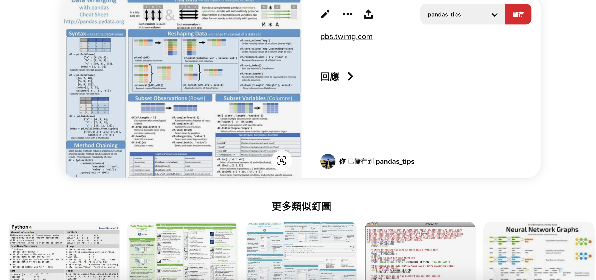
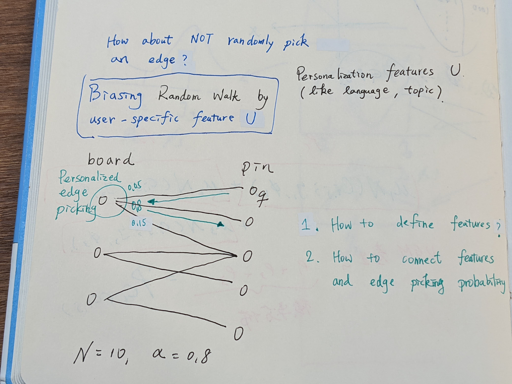
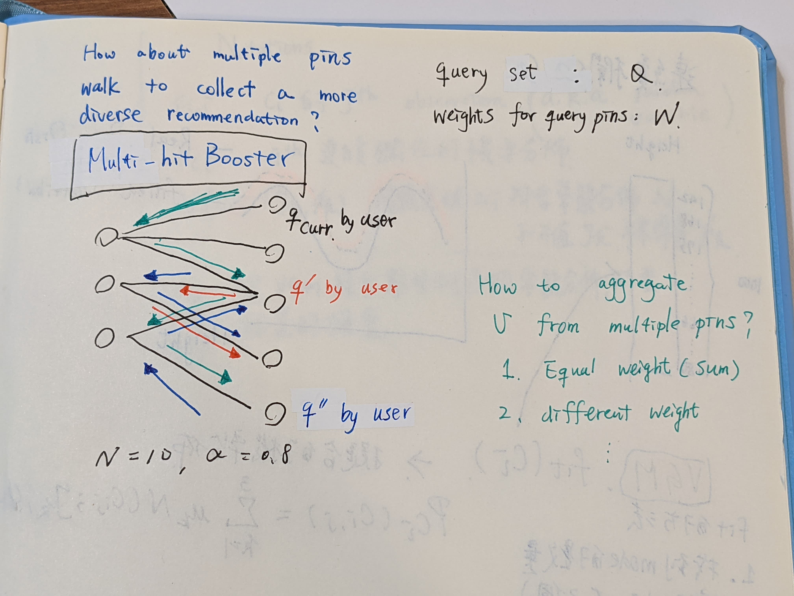

# Pixie: A System for Recommending 3+ Billion Items to

200+ Million Users in Real-Time

[paper](https://arxiv.org/pdf/1711.07601.pdf)

[code : rust, partitally implement star 5+](https://github.com/JD557/pixie-rust)

benchmark : pintrest private dataset.

# Abstract

3 billion nodes and 17 billion edges. 

single server : 1200 requests/second, 60 ms latency.

single terabyte-scale RAM machine.

Today, systems backed by Pixie
contribute to more than 80% of all user engagement on Pinterest.

[connected papers](https://www.connectedpapers.com/main/b120a10310645df329c691b782dea9ceb7dfe786/Pixie-A-System-for-Recommending-3-Billion-Items-to-200-Million-Users-in-RealTime/graph)

# Idea

pin $p$ board $b$  : Bipartite Graph. (Not user-pin graph)

</img>

</img>

**4 ways to improve basic random walk**

</img>

## 1. Biasing the random walk. 

we use board-pin graph, but we wanna involve user information in the current timesatemp. 

such like 
   * language the user current used.
   * topics the user liked(maybe from another tagging system)

   We biasing the random walk by changing the random edge selection to be biased based on user feature.

   In practice, this modifications turns out to be very important as it improves personalization, quality, and topicality.

</img>

## 2. early-stopping 

we want our walk steps be efficient(as few but useful as possible).

so we defined a stopping criteria.

The idea is pretty straight-forward : 

The pins distribution goes more stable when n_steps growth.

So just set the number of highest visited pins $n_p$ to a fix number.

Of course the fix number need to be decide by some graph analysis.

The comparision between simple random walk and pintrest random walk so far : 

</img>

</img>

## 3. Multiple Query Pins with Weights 

User hold a lot of pins with different board. Once user selected a pin, system get multiple user pins random-walk.

</img>

How to give the weights for each histrotical pins?

1. equal weights
2. exponential decay wieghts by the timestamp
3. pintrest's weight method comes from their insight

    ### Degree Normalization

    from pintrest insights.

    meaningful visit counts depends on the query pin's degree.

    recommending from a high degree query pin that occurs in many boards requires more steps than from a pin with small degree.

    hence, we scale the number of steps allocated to each query pins to be proportional to its degree.

    high degree pins(popular pins) needs more steps to converge.

    apparently, we can decide the steps according to the query degree. degree bigger, more steps assigned.

    1. linear relation between pins degree and number of steps to converge visit counts. - didn't working.
    2. sub-linearly relations query pin degree, the scaling factor.

    $$
    s_{q} = |E(q)| \cdot (C - log|E(q)|)
    $$
    

    3. the numbers of steps of query $N_{q}$ : 

    $$
    N_{q} = w_{q}N\frac{s_{q}}{\sum_{r \in Q}s_r}
    $$

    Then we have a degree(popularity) normalization
    algorithm with multiple querys

</img>

4. Multi-hit Booster

we run *Algorithm 2* $Q$ times to obtain $V_{1}, V_{2}, ... V_{Q}$, where $V_{q}$ is a $P$ dimentional vector.($P$ represent total number of pins)

5. graph purning - not all boards on Pintrest are topically focus. prune the big graph into small graph.

Implement on the top of [Stanford Network Analysis Project](http://snap.stanford.edu/)

# Result

# Other Discussion

pixnet : 0.8 billion articles, user counts in million scale. - this might be a great reference to build random walk recommendation system for pixnet.

[single sever with highest RAM wecan use on GCP ~ 0.7TB](https://cloud.google.com/compute/docs/machine-types)
