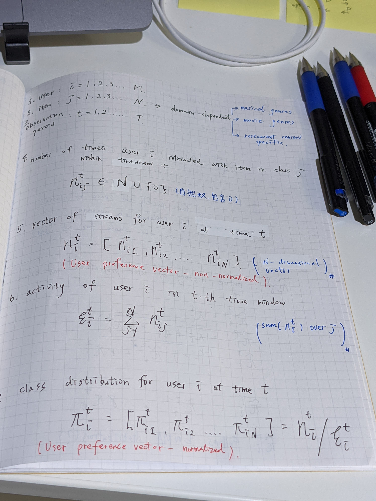
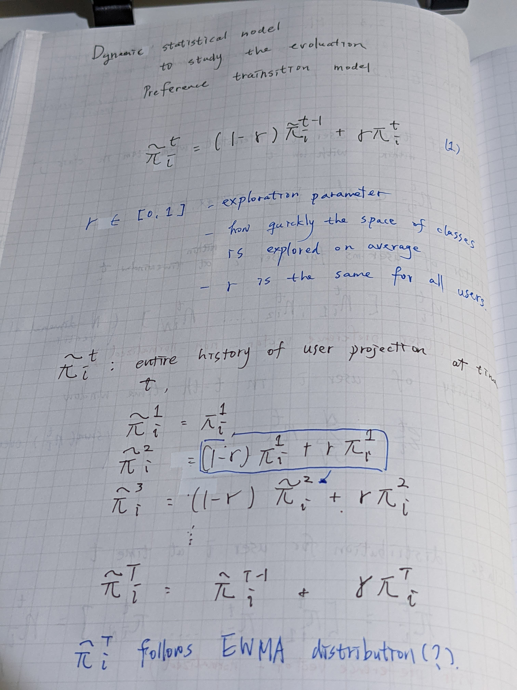
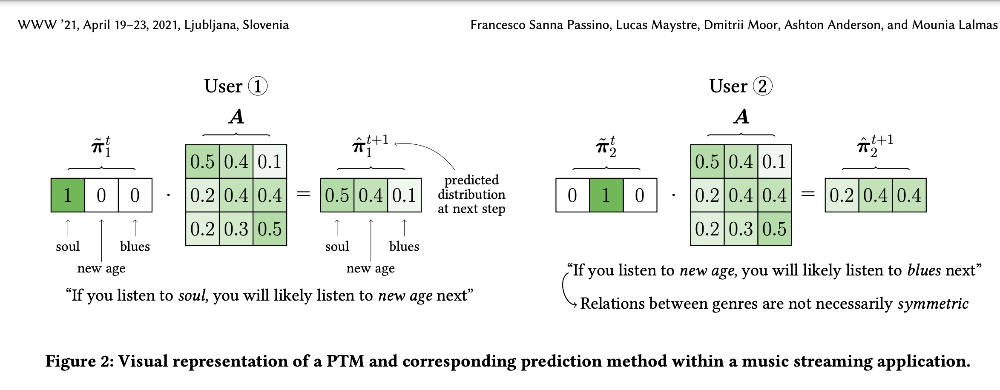
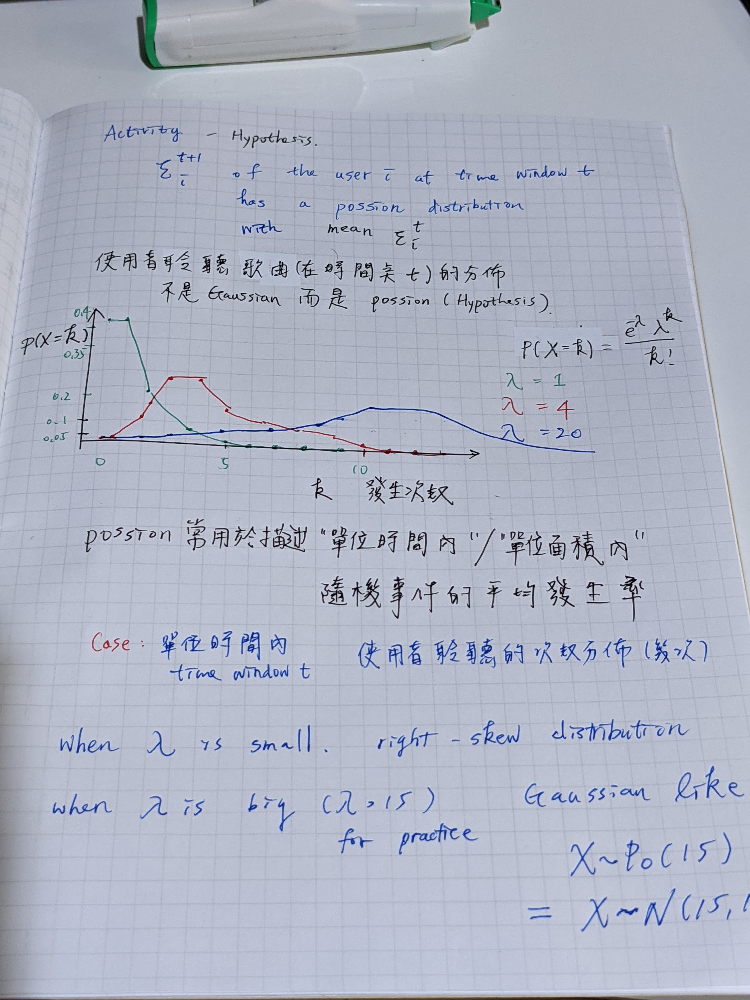
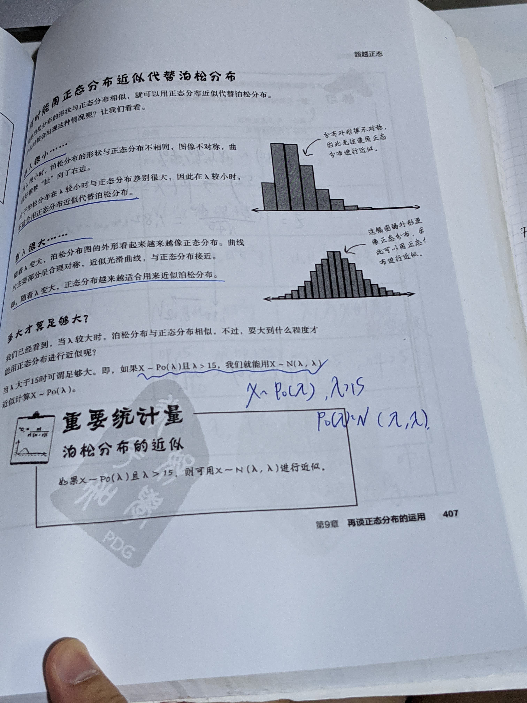

# Where To Next? A Dynamic Model of User Preferences

[paper](https://www.cs.toronto.edu/~ashton/pubs/spotify-ptm-www2021.pdf)

github - NA

benchmark - spotify, lstfm, movielens, yelp

# Abstract

1. 常見的推薦系統會推薦使用者喜歡的內容，這對使用者來說會形成一個同溫層
2. 我們針對使用者的喜好如何轉變這件事建了一個統計模型
3. 這個模型具有很多可解釋的insights、並且可以幫助我們設計下一代的推薦系統

# Idea
## Introduction
e.g.  1年前我超愛聽 Rap，但我現在都聽鄉村音樂XD
Spotify 自己公司內部的Dataset、音樂可以被歸類成4000多種類型(總數為 N)，方法論則是採用統計建模
考慮使用者 i 在某個時間區間 t 聽的歌曲，把那段期間使用者聽的歌曲個別映射到4000多種音樂類型，再做個Normalization，就可以得到使用者 i 在某個時間區間 t 的音樂風格向量 pi
有了音樂風格向量 pi 就可以定義轉移矩陣 A (NxN) ，每經過一次 pi dot A ，就意味著使用者 i 的音樂風格的一次轉變，也就是說，如果時間區間 t= 一天，連續對一個 pi 操作365次就得到他一年之後的喜好
後續的細節大概就是去假設使用者以及所有音樂風格符合某個統計分佈，並且計算一個 likelihood，並基於label data去計算 maximum likelihood 的情況下，統計模型的參數會是多少，他們將他們設計的模型稱為 Preference Transition Model (PTM)
benchmark 的部分 拿了一些統計模型以及 Non-Negtive Matrix Facotrization (NMF) 來比較，資料集都是選用短期而言使用者偏好不易改變，長期而言有可能改變的Dataset，例如 音樂(Spotify, lstm-fm)、電影(MovieLens)、餐廳美食評價(Yelp)
值得一提的是對音樂風格轉移矩陣 A 其實可以做蠻多後續的探索，在第5章有提到~

## Model

</img>

</img>

hypothesis : 使用者的聆聽風格和他過往的風格以及當下的風格有關係

EWMA distribution : Exponential Weighted Moving Average Distribution

</img>

</img>

另一個好處 - 只要估計一個參數，而不是兩個(gaussion要兩個參數)

</img>

# Result

# Other Discussion

## With Pixnet

至於跟我們有什麼關係? 我不太確定，他們的使用者喜好變化的速度很慢(months ~ years)，而且使用者具有黏著度(有意識的情況下持續使用Spotify)
來我們站內的幾乎每次意圖都不太一樣XD (今天來找吃的，明天來找旅遊，哎呀最近疫情，來找找食譜)，甚至使用者其實也不是特別在找我們站內的文章，而是它google的關鍵字我們恰巧第一頁都有(使用者可能甚至不知道自己在痞客邦裡面)

## With Other Statistical Modeling

airbnb demand forcasting

https://github.com/YLTsai0609/airbnb_demand_forcast

distribution

https://github.com/YLTsai0609/DataScience_Note/blob/master/All_about_the_distribution.md

possion 

https://zh.wikipedia.org/wiki/%E5%8D%9C%E7%93%A6%E6%9D%BE%E5%88%86%E5%B8%83
