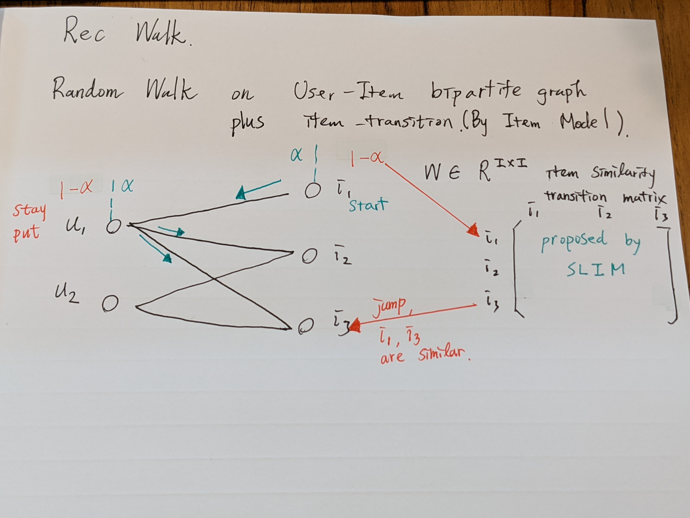

# RecWalk: Nearly Uncoupled Random Walks for Top-N Recommendation

[paper](https://dl.acm.org/doi/pdf/10.1145/3289600.3291016?casa_token=FptgHIPh610AAAAA:695jSPFowSeeqZ_owl56h71XRz51_rnSTMthjv_cjXNuOQBK3kOVX1PDFda55YQsdvaBPWp6x1s)

[code : julia 15+ stars](https://github.com/nikolakopoulos/RecWalk)

[code : python 3+ stars](https://github.com/titoeb/RecModel)

benchmark : movielens, yahoo! R2Music, pintrest 

# Abstract

1. claim : RecWalk leverages the spectral properties of *nearly uncoupled Markov chains* to provably lift this limitation and prolong the infliuence of user's past preferneces on the seccessive steps of the walk.

2. We do actually achieve a significant improvement on 3 dataset above!

3. Randomwalk + ItemModel(proposed in SLIM)

# Idea

</img>

</img>

There are K-steps and PR methods.

K-steps : you can run any times of random walk jumping.

PR methods : theorically coverage(although we still need to set a tolerance)

Notations :

1. $A_{G} \in \R^{U+I \times U+I}$ : adjacency matrix.

</img>

2. $P \in R^{(U+I) \times (U+I)}$  : mixed transition matrix of simple random walk and inter-item transition probability

</img>

3. $H \in R^{(U+I) \times (U+I)}$ : transition matrix(maybe normalized by outdegree)

4. $M \in \R^{(U+I) \times (U+I)}$ : inter-item transition probablity matrix

</img>

</img>

5. $e_{u} \in R^{(U+I)}$ : start vector contains the element 1 on the position that corresponds to user $u$ and zeros elsewhere.

6. $\pi_{u}$ recommendation vector of user $u$

simply, K steps method can be presented by 

$$
\pi_{u}^{T} = e^{T}_{u}P^{K}
$$

Using *Algorithm 2* to generate recommendation with single one loop.

Also, follow eq(4). 

when we set $\alpha = 0$, we get slim.
when we set $\alpha = 1$, we get simple random walk.

# Result

</img>

</img>

TODO - algorithm to know table 2 setting including $C$, $\gamma_{1}, \gamma_{2}$

# Other Discussion

From source code python 3+ stars

we know the training phase (actually no training ..., it's need a item model trained from slim)

then build matrix.
