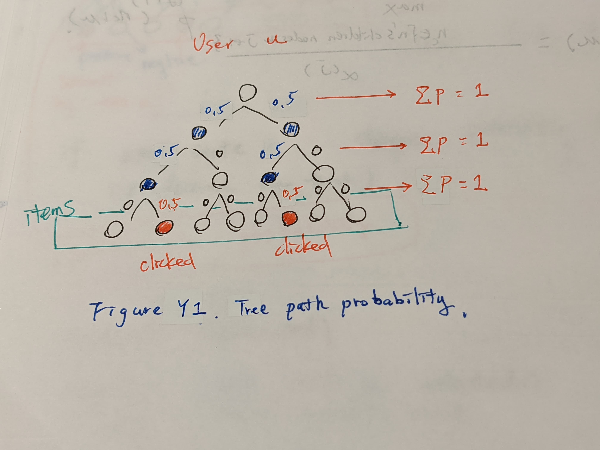
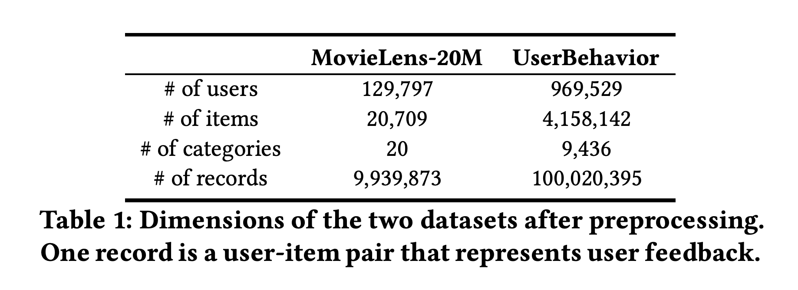
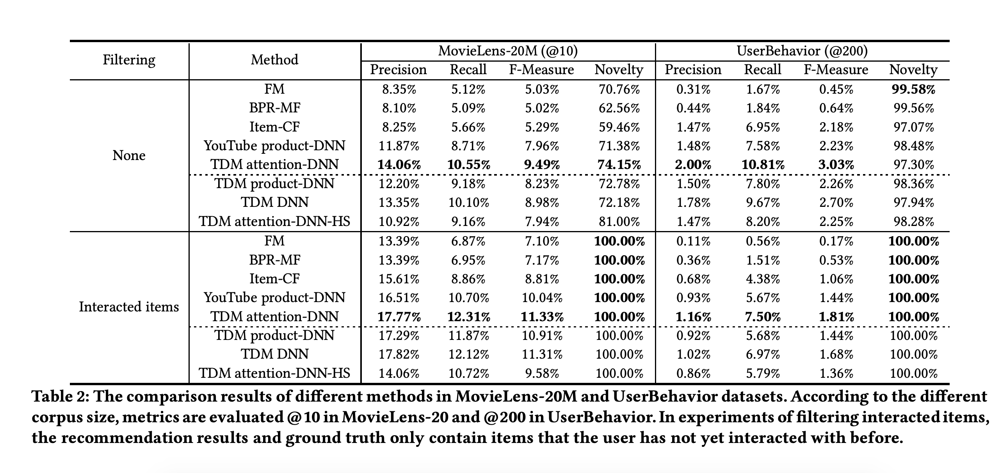

# Learning Tree-based Deep Model for Recommender Systems

[paper]([link1](https://arxiv.org/pdf/1801.02294.pdf))

[github star 39+](https://github.com/LRegan666/Tree_Deep_Model)

benchmark 

MovieLens-20M

[UserBehavior on taibou](https://tianchi.aliyun.com/dataset/dataDetail?dataId=649&userId=1)

# Abstract

1. In system with large corpus, the calculation cost for the laent model to predict all user-item preference is trnedous, which makes full corpus retrieval extremely difficult.

2. tree-based method can provide logarithmic complexity with respect to corpus size even with more expressibe models syck as dnn.

3. tree structure can be jointly learnt towards better compatibility with user's intrest distribution and hence facilitate both training and prediction.

# Idea

## Interest tree modeling -  Max-heap like tree is a tree structure

user $u$ interacted item $n_c$ at tree level $j$ : $p^{(j)}(n_c | u) = 1$

how to propagate category preference from items? - keep the maximum, do layer normalization(first version, we keep it simple)

preference propagation fomula : 

$$
p^{j}(n|u) = \frac{\mathop{max}\limits_{n_{c} \in J} p^{(j+1)} (n_c | u)}{\alpha^{(j)}}
$$

$J$ is the n's children noeds in $j+1$ level.

e.g. user $u$ click 2 items.

</img>

## Algorithm to pick Top - k

Deep Model

# Result

</img>

</img>

# Other Discussion

[最大堆+检索树+用户兴趣层级+深度模型](https://www.zhihu.com/question/362190044)

[阿里妈妈新突破：深度树匹配如何扛住千万级推荐系统压力](https://blog.csdn.net/cpongo3/article/details/89027848)

[TDM Serving Alibaba official doc](https://github.com/alibaba/x-deeplearning/wiki/TDMServing)

# Stats

2 hr - tree construction, search algorithm
