# Learning Tree-based Deep Model for Recommender Systems

[paper]([link1](https://arxiv.org/pdf/1801.02294.pdf))

[github star 39+ 2019](https://github.com/LRegan666/Tree_Deep_Model)

[github star 20+ 2020](https://github.com/andrew-zzz/tree-based-deep-model)
benchmark 

MovieLens-20M

[UserBehavior on taibou](https://tianchi.aliyun.com/dataset/dataDetail?dataId=649&userId=1)

# Abstract

1. In system with large corpus, the calculation cost for the laent model to predict all user-item preference is trnedous, which makes full corpus retrieval extremely difficult.

2. tree-based method can provide logarithmic complexity with respect to corpus size even with more expressibe models syck as dnn.

3. tree structure can be jointly learnt towards better compatibility with user's intrest distribution and hence facilitate both training and prediction.

# Idea

## Interest tree modeling -  Max-heap like tree is a tree structure

user $u$ interacted item $n_c$ at leaves, how to construct category?

how to propagate category preference from items? - keep the maximum, do layer normalization(first version, we keep it simple)

preference propagation fomula : 

$$
p^{j}(n|u) = \frac{\mathop{max}\limits_{n_{c} \in J} p^{(j+1)} (n_c | u)}{\alpha^{(j)}}
$$

$J$ is the n's children noeds in $j+1$ level.

$\alpha^{(j)}$ is the layer-specific normalization term of level $j$ to ensure that probability sim in the level equals to 1.

$p^{j}(n|u)$ a.k.a. the ground truth probability that user $u$ is interested in $n$

e.g. user $u$ click 2 items.

</img>

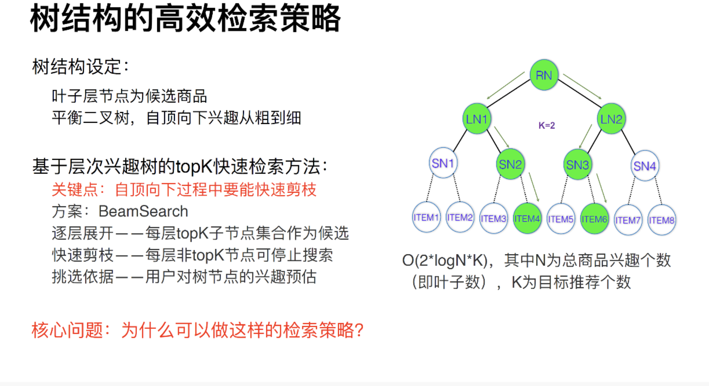</img>

## Algorithm to pick Top - k

beam search 

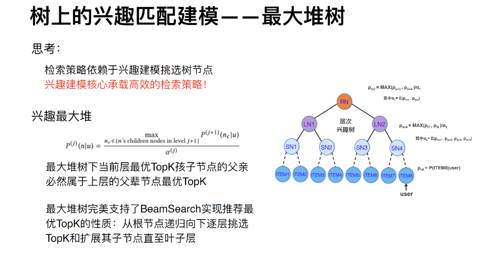</img>

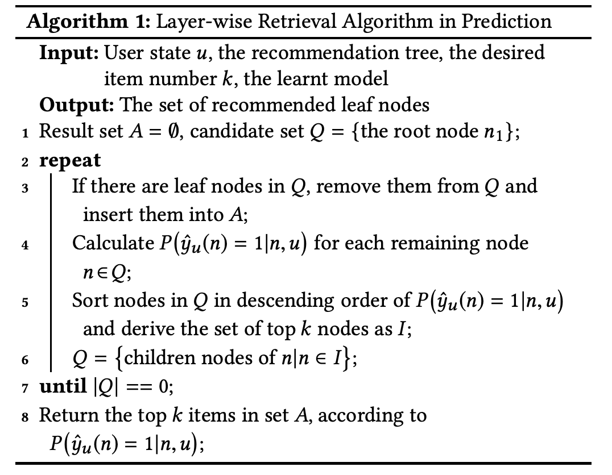</img>

## How to learn?

How to learn a tree match our design?

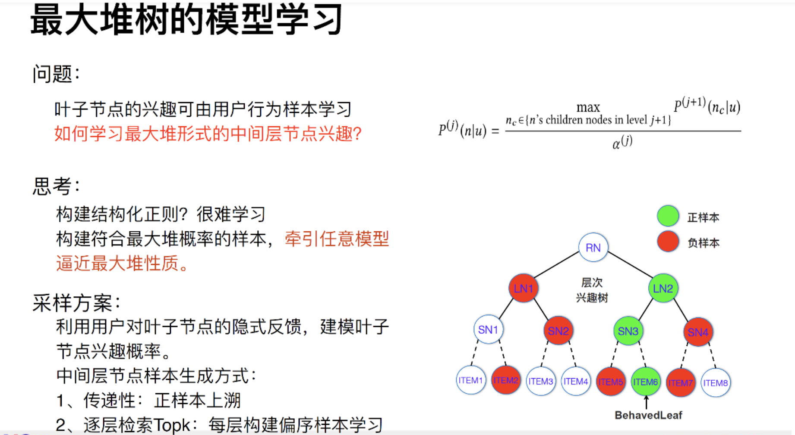</img>

fit a simple model at each layer $j$ to match our ground truth probability distribution.

postive sample : behaviored by user

negtive sample : random sampling from non-brhaviored.

### learning the tree tructure by layerwise classifier

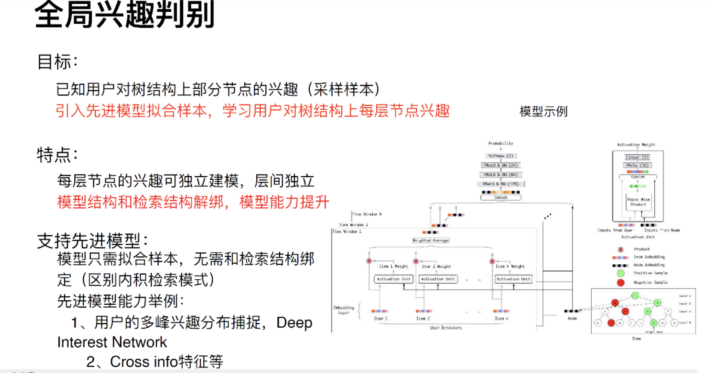</img>

The node at $j$ should make the node $j+1$ more separable!

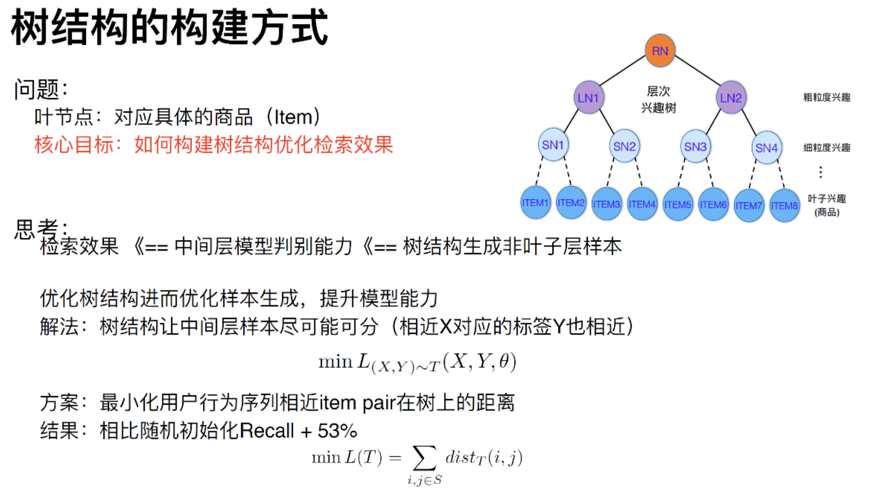</img>

### combining any candidate generation model

# Result

</img>

</img>

# Summary

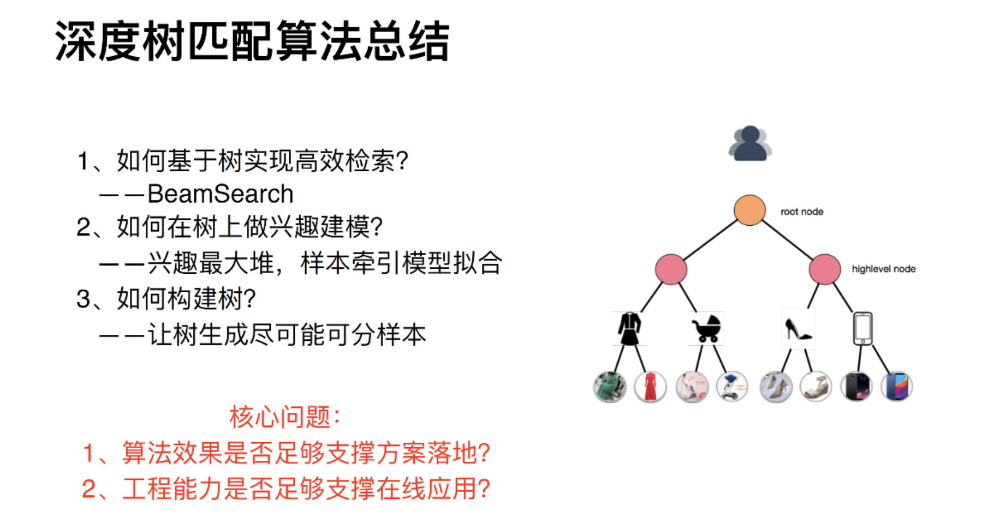</img>

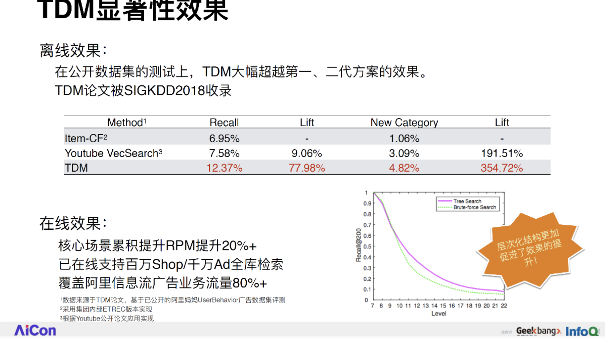</img>

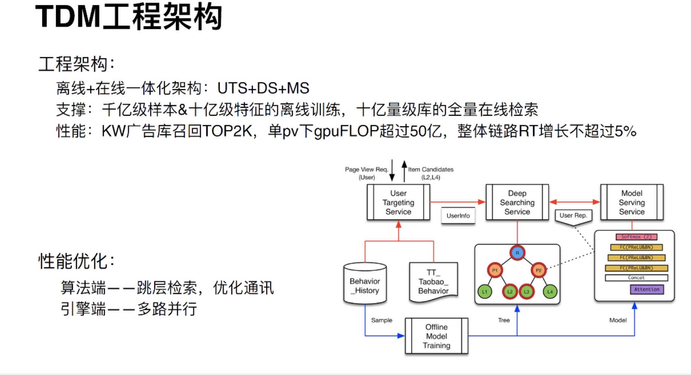</img>

# Other Discussion

[最大堆+检索树+用户兴趣层级+深度模型](https://www.zhihu.com/question/362190044)

[阿里妈妈新突破：深度树匹配如何扛住千万级推荐系统压力](https://blog.csdn.net/cpongo3/article/details/89027848)

[TDM Serving Alibaba official doc](https://github.com/alibaba/x-deeplearning/wiki/TDMServing)

# Misc

| terminology | means | note |
|-------------|-------|------|
| 檢索        |   calculate fast in candidate generation    |      |
| 召回/匹配        |  calculate accuract in candidate generation     |      |

|召回环节 / 匹配环节|candidate generation|

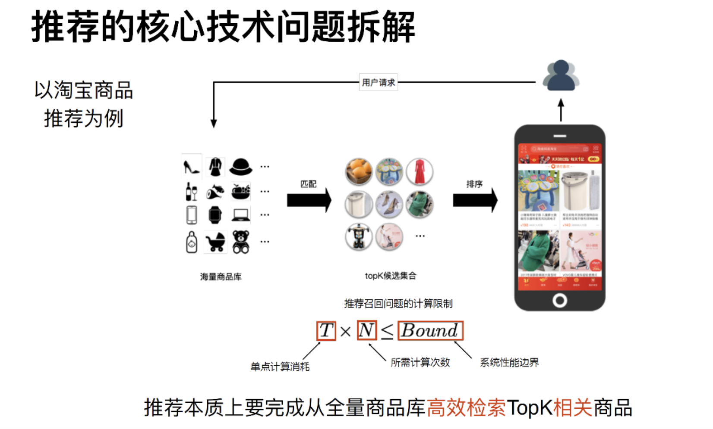</img>

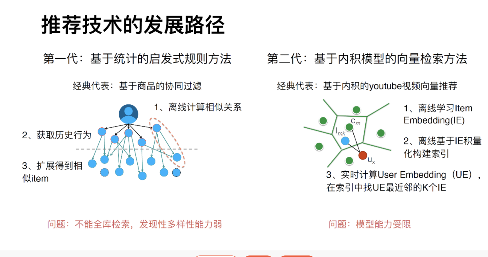</img>

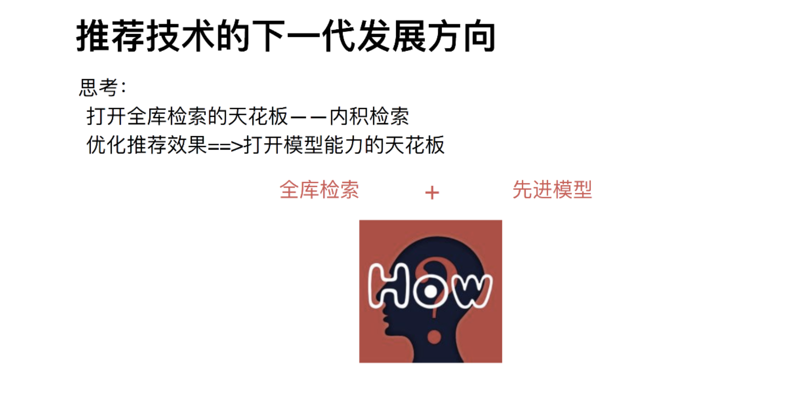</img>

They basically break the candidate generation part into retrieve(檢索) and recalling(召回)

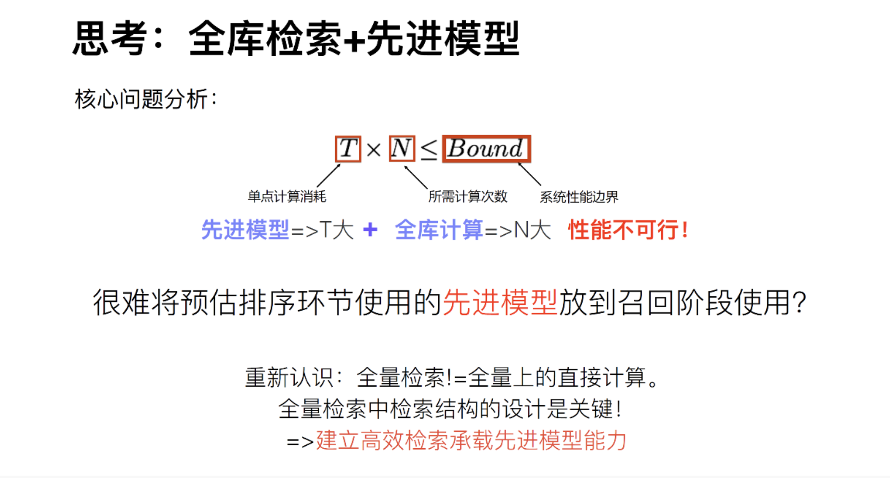</img>

Big number of $U$(users) and $I$(items), so we have to do this.(Tree based candidate generation Deep Learning Model)
