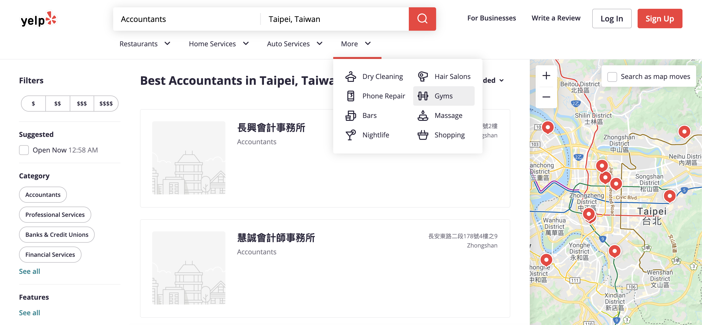
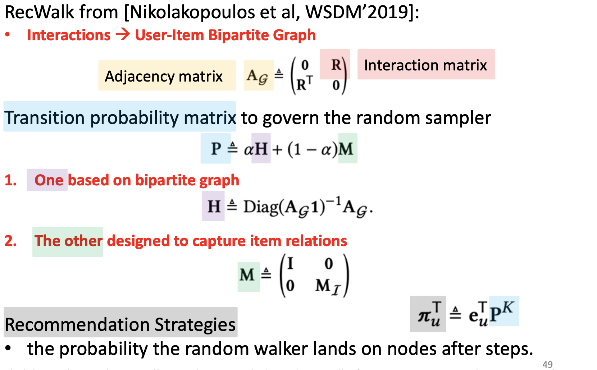

# Paper Title

[pdf](https://next-nus.github.io/slides/tuto-cikm2019-public.pdf)

# Abstract

1. Preliminary of Recommendation

2. Random walk for Recommendation

3. Network Embedding for Recommendation

4. Graph Neural Netyworks for Recommendation

# Hsitroy

</img>

</img>

</img>

TODO

Genral Paradigm

Information Isolated Island (1, 2, 3, 4)

# Random walk based approach

## Random walk

</img>

Conditional probability represent a transmition probability.

</img>

Bipartitle graph as a simplest approach.

## Asorption : Random Walk Through View Graph(2008, 500+ citations, Bakuja et al)

[paper](https://dl.acm.org/doi/pdf/10.1145/1367497.1367618?casa_token=fd3ZjMMcdcIAAAAA:jD7FGKFX0m9zBMvUG3lWGrdZot7JL6eucg0dPS4CC1TPfxgkiWygVkgPZYYccUYopF0tRMlDPCvRdNM)

[code java, mapreudce on hahoop 2+ stars](https://github.com/natc221/AdsorptionMR)

</img>

Overview approach

Two ways to build user-video relation

</img>

The Video-Video Co-View Graph

1. Define a ofter co-viewed as a edge link

   * This is my guessing 
   1. (e.g. start with item $A$, most co-viewed top 3 ：
   2.  $B, C, D$)
   3. link $A \rightarrow B$, $A \rightarrow C$, $A \rightarrow D$

      Where $B$ is the most co-viewed when saw $A$

   4. repeat 1, 2, create $E, F, G$ where $E$ is the most co-viewed when saw $B$ 

</img>

User-Video Graph

Co-views : path of length 2 that exist between any two videos

The asorption algorithm

## ItemRank: A Random-Walk Based Scoring Algorithm for Recommender Engines(2007, citations 300+, Marco Gori)

[paper](https://www.aaai.org/Papers/IJCAI/2007/IJCAI07-444.pdf)

code None

</img>

Insprie by pagerank

## TriRank: Review-aware Explainable Recommendation by Modeling Aspects(2015, citation 250+ Xiangnan He)

[paper](https://dl.acm.org/doi/pdf/10.1145/2806416.2806504?casa_token=DvKEyCuR_tkAAAAA:mUDyb4lRpcNG4Jcs7lOVhFVDGl7Dcja5R1Bd_iVZh9_7Yp5RaKwk9DclCm534FT4w-C1b_aqxwA)

code None

user - aspects - items

aspects(the specific properties of items)

</img>

</img>

Yelp : comment website

</img>

## Pixie: A System for Recommending 3+ Billion Items to 200+ Million Users in Real-Time.(2018, citation 70+, Eksombatchai et al)

</img>

[paper](https://next-nus.github.io/slides/tuto-cikm2019-public.pdf)

## RecWalk: Nearly Uncoupled Random Walks for Top-N Recommendation(2019, citation 22+, Nikolakopoulos et al)

</img>

[paper](https://dl.acm.org/doi/pdf/10.1145/3289600.3291016?casa_token=FptgHIPh610AAAAA:695jSPFowSeeqZ_owl56h71XRz51_rnSTMthjv_cjXNuOQBK3kOVX1PDFda55YQsdvaBPWp6x1s)

[github-1 julia](https://github.com/nikolakopoulos/RecWalk)

[github-2 python](https://github.com/titoeb/RecModel)

claim : RecWalk leverages the spectral properties of *nearly uncoupled Markov chains* to provably lift this limitation and prolong the infliuence of user's past preferneces on the seccessive steps of the walk.

SOTA on several open dataset, including recently proposed methods that rely on deep neural networks.

## Summary

</img>

| Method              | Idea                                                        | benchmark|code|
|---------------------|-------------------------------------------------------------|----------|----|
| PersonalRank (2002) | PageRank apporach + user-item bipartite graph(equal weights |movielens | y  |
|Adsorption(2008), Youtube|use user-item bipartie graph to propergate user information   also some node injection dirty work|N/A|Java, star 2+|
